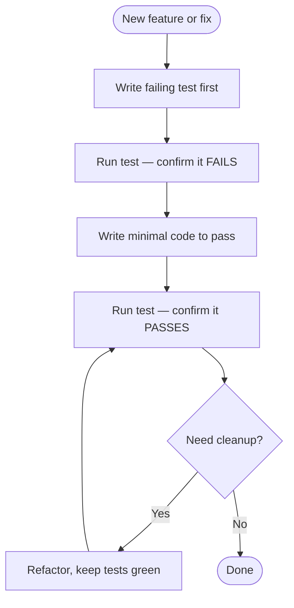

# Testing Guide

## Overview

This is a documentation project. The primary "tests" are:

1. **Build verification**: `npm run build` must succeed
2. **Local preview**: `npm run start` for visual verification
3. **Link validation**: No broken links between docs

## Verification Checklist

After making documentation changes:
- [ ] `npm run build` succeeds without errors
- [ ] Pages render correctly in local dev server
- [ ] Internal links work
- [ ] Images display properly
- [ ] Sidebar navigation is correct
- [ ] No console errors in browser

## Test-Driven Development (TDD)

TDD applies primarily when modifying build scripts, components, or the LLM processing pipeline — not documentation content.

### TDD Workflow

### When to Apply TDD

| Scenario | Apply TDD? |
|----------|-----------|
| New React component | Yes |
| Build script changes | Yes |
| LLM pipeline changes | Yes |
| Documentation content | No — use build verification |
| Config changes | No — use build verification |
