import YouTubeEmbed from "@site/src/components/YouTubeEmbed";

<YouTubeEmbed embedId="zHDmcl2pIh0">Docusaurus green</YouTubeEmbed>

## Dependencies
In this exercise, we use the NPM package JSON-server to emulate a REST API locally. We then use Boozang to create a data-driven API test consisting of create-operations and edit-operations, along with validations.

I based this post on the blog post from Sebastien Eschweiler: https://medium.com/codingthesmartway-com-blog/create-a-rest-api-with-json-server-36da8680136d.

It’s a great starting point as it gives a more in-depth look at JSON-server and Postman.

## Installing JSON server
JSON server is a handy tool to emulate an API. Start by installing the npm package globally on your computer.
```
npm install -g json-server
```
Next, create a db.json with the following content.

```
{ 
 "employees": [
  { 
   "id","1",
   "first_name": "Mats",
   "last_name": "Ljunggren",
   "email": "aa@bb.com"
  }
 ]
}
```
Start the server locally. 
```
$ json-server --watch db.json
```
You can now easily verify that the API is running by accessing the URL in your browser: http://localhost:3000

## Getting started in Boozang
You can skip this section if you have already created an account and are familiar with Boozang.

### Signing up
To get started, sign-up for a free account at: boozang.com.

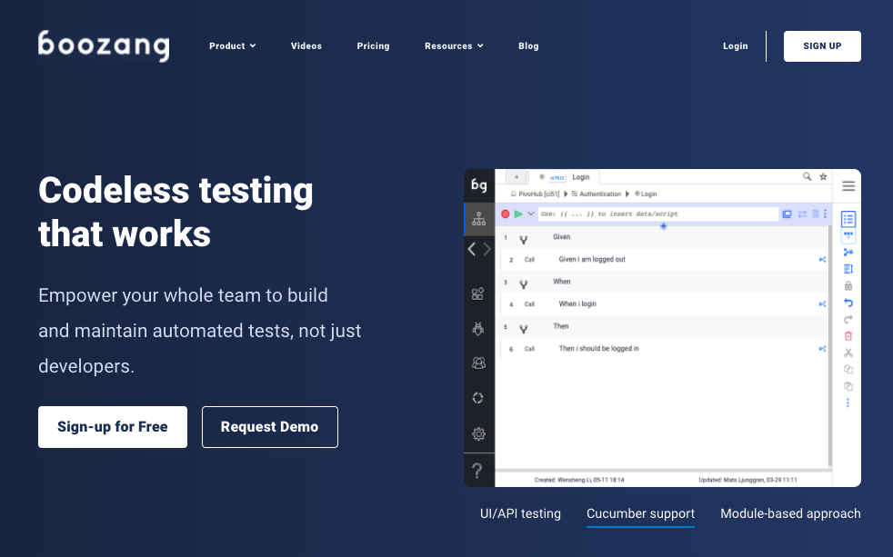

You will receive a confirmation email, and you are ready to get started.

We recently opened up the free tier of Boozang to unlimited API testing.

### Creating your first project
Go ahead and create your first project by clicking the “New project” button. Let’s name the project: “API lab” and click “Submit.” You can ignore the other options for now.

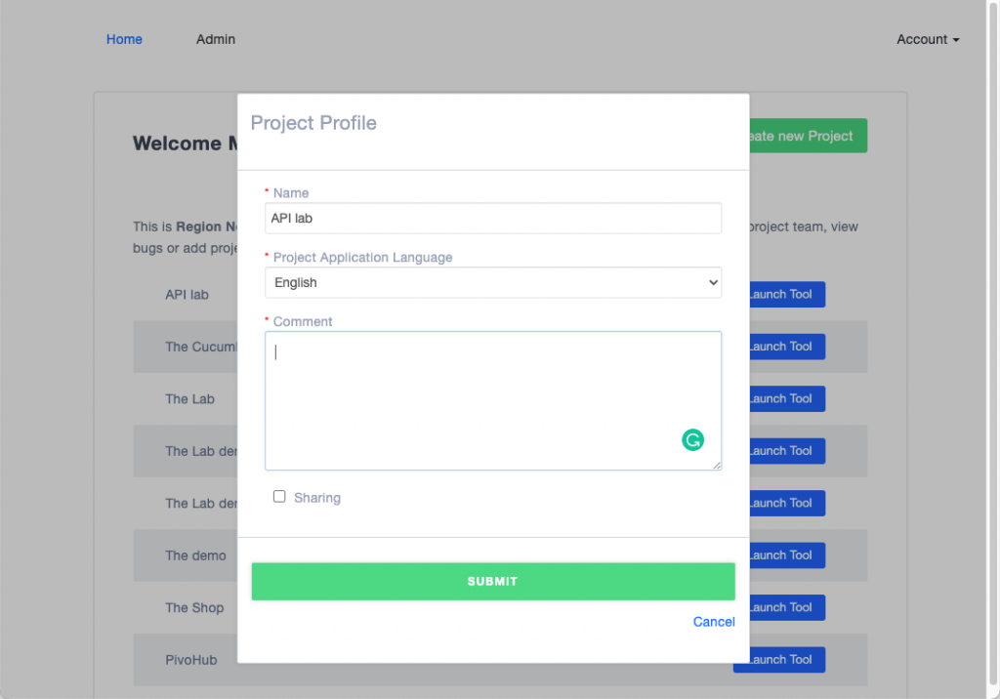


As you can see, the project will show in the project list.

### Installing the extension
To launch the Boozang tool, you’ll need a supported browser. Supported browsers are Google Chrome, Microsoft Edge, or Chromium. Go ahead and install the Boozang extension using the browser of your choice.

The extension can be found here.

### Launching the tool
Launch the tool by clicking launch next to the project name “API lab” in the management UI. The Boozang tool (or the IDE) will be launched in a new browser window. This window is running locally in your web browser and can be treated similarly to a desktop application.

Start by entering the URL to your local JSON-server when you get prompted for Environment config. You can always revisit this configuration in the Settings -> Environment using the sidebar navigation.

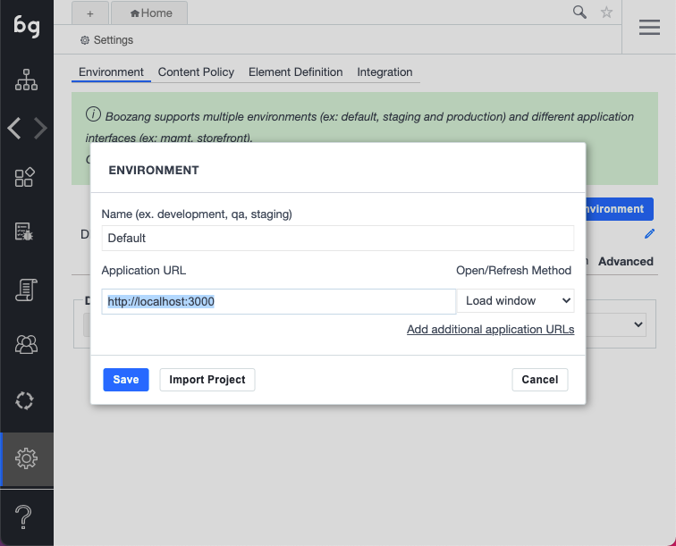

BTW: If you get prompted to “Enable AI authorization,” go ahead and skip this step.

### Switching to test authoring view
Make sure to navigate to the top icon using the sidebar navigation. You are now at the test authoring view, where you can create modules and tests. In Boozang, a module-based tool, all tests need to be inside modules.

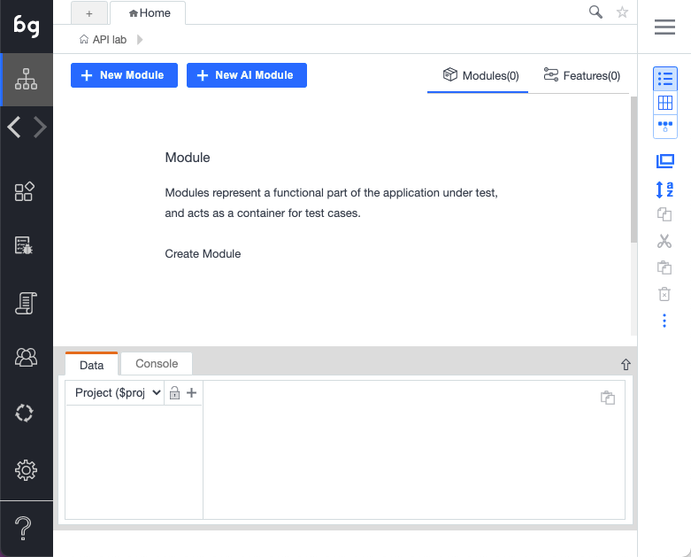

Even though all the work we will do from now on will be in this authoring view, try playing around using the sidebar to discover what can be done using the tool.

### Module and test creation
Boozang is comprised of modules and tests. Start by creating a module from the authoring view by clicking “New module.” Enter the module name “JSON server”.

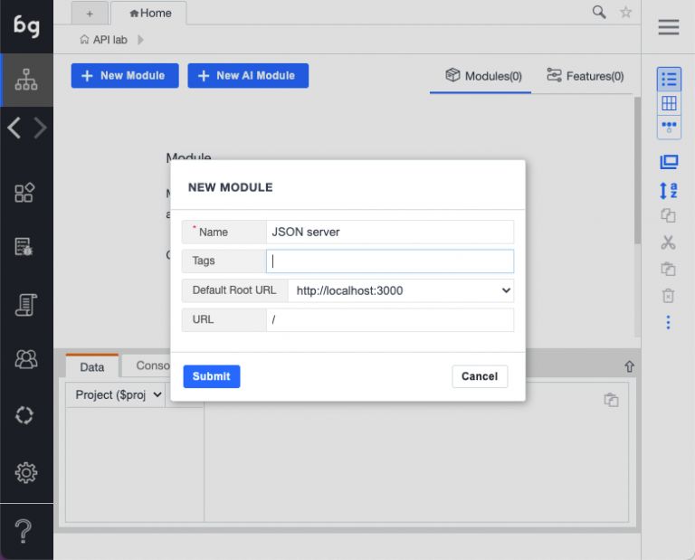

To create a test, make sure you click into the module “JSON server” and select the API tests from the module tabs. Click “New API test”.

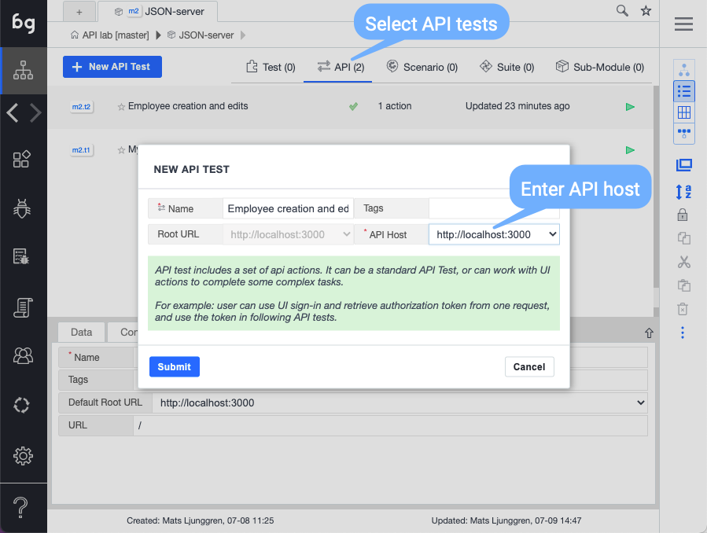

You can now select the JSON server you installed as your API host. GO ahead and click “Submit,” and you will see an empty API test created.

As soon as you create a new API test, you can access the API action details.

## Getting started with API tests
The steps we have taken previously were for setup only. We can now make all the rest of the API requests inside the same API test.

## Defining data: Employee

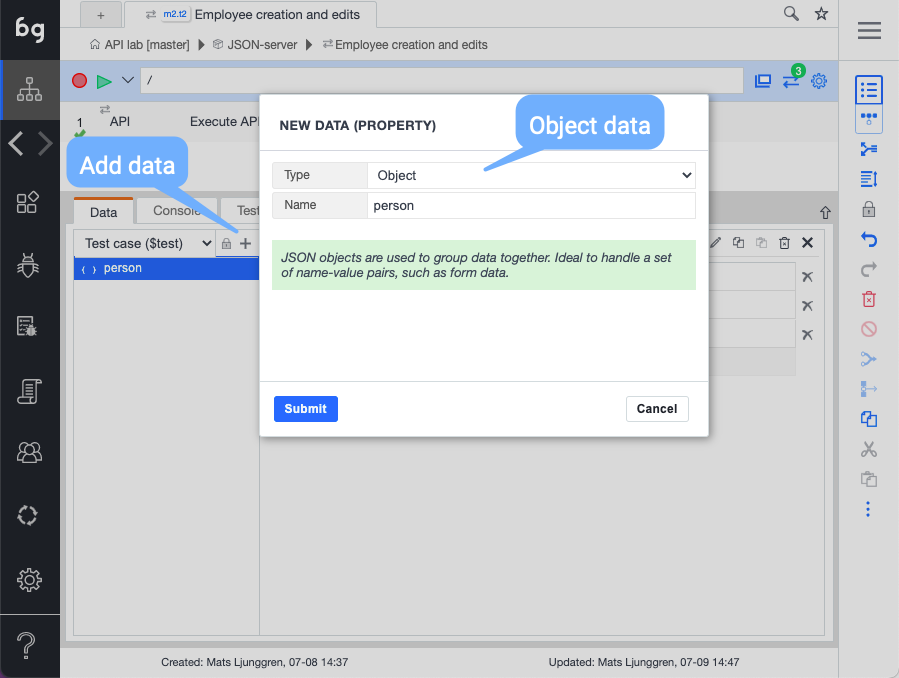

Start by defining the data we will use. Let’s start by going to the Data tab, adding object data on the $test level, and entering the following information.
```
{
"firstname":"Mats",
"lastname":"Ljunggren",
"email":"mats.ljunggren@boozang.com"
}
```
See below screenshot

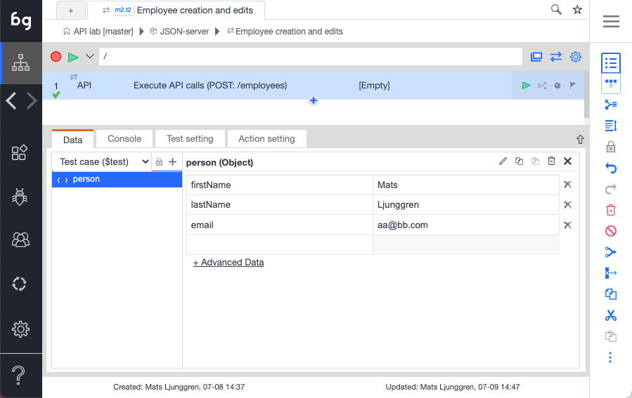

### First API call: Create employee
Now it’s time to do the initial API call – to create the employee data via the employee. This is done using the HTTP method POST. 

Make sure you use the dynamic data in the body of the request according to the picture below.

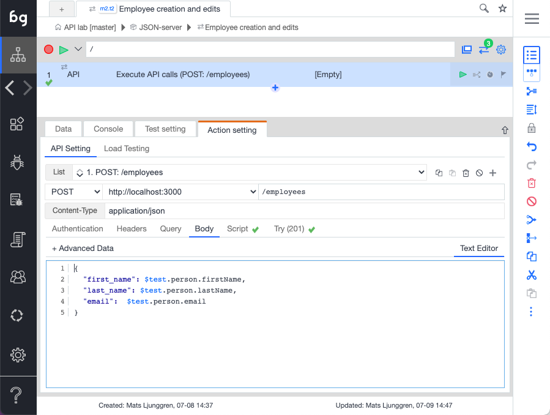

Do you get a green checkmark? Try it using the play button within the “Try” tab.

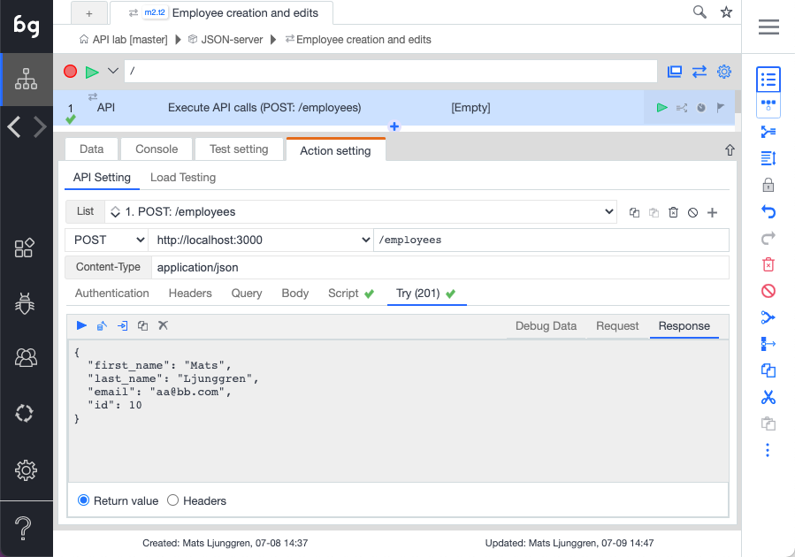

Great, let’s move on. 

### First API validation: Create employee
The green checkmark on the “Try” tab is great, but what does it tell us? It only tells us that the request went out successfully. You can also see a green checkmark on the “Script” tab. Let’s look a little closer at this.
```
(()=>{
  if($result.status>=400){
    return false;
  }

  return true;
})()
```
Here, a return value of false means the API call failed, and a return value of true means success. By default, we are only looking for HTTP status codes < 400. Let’s tune this a little bit to make validation a little stricter.
```
(()=>{
  console.log("BZ-LOG: ### Result: " + $result.responseJSON.id)
  if ($result.status >201) {
    return false;
  } 
   
  console.log("BZ-LOG: ### Result: " + $result.responseJSON.id)
  $test.response_id=$result.responseJSON.id;
  return !isNaN($result.responseJSON.id);
})();
```
That’s better.   

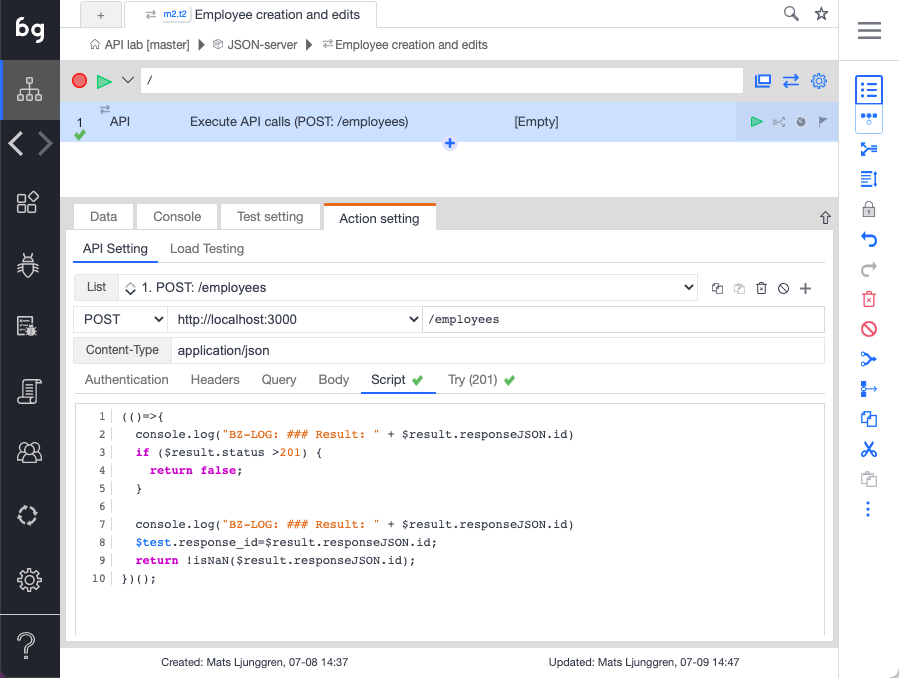

### Saving the id
It’s often necessary to save some data from a previous API call to be used in a subsequent one. This example is not an exception. Here we would like to save the id. We can do that in a very straightforward manner in Boozang.
```
$test.response_id=$result.responseJSON.id;
```

### Second API call: Retrieve employee

We want to make sure the data has been saved in the API server correctly. We will use the GET function for this.

Now we could choose to add one more API action to the test. Instead, we will add an additional API call to the API test using the plus button (+) next to the API call drop-down to keep it simple.

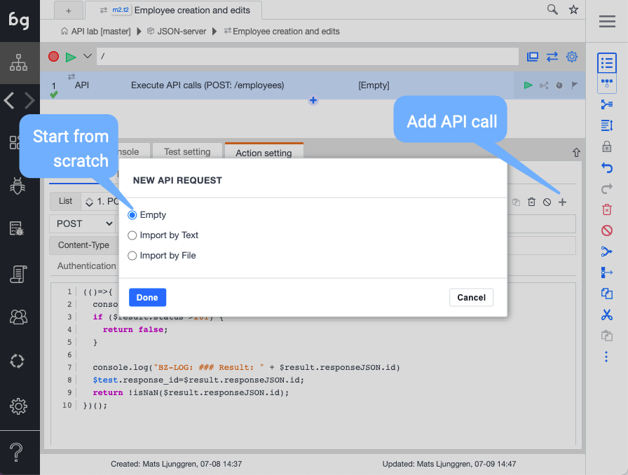

We get a new blank test to work with.

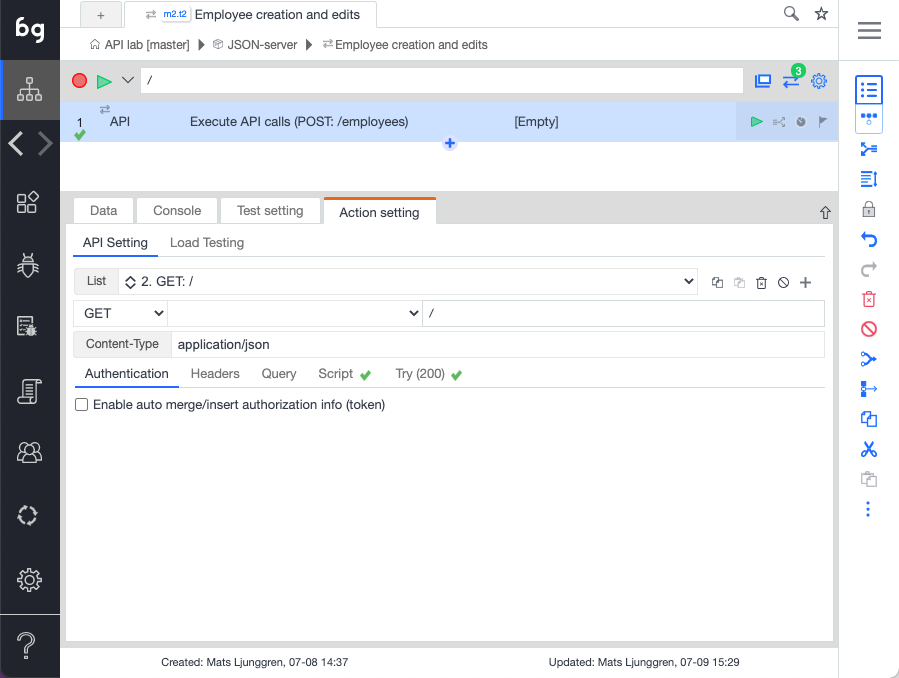

Make sure to fill out the host field and end-point

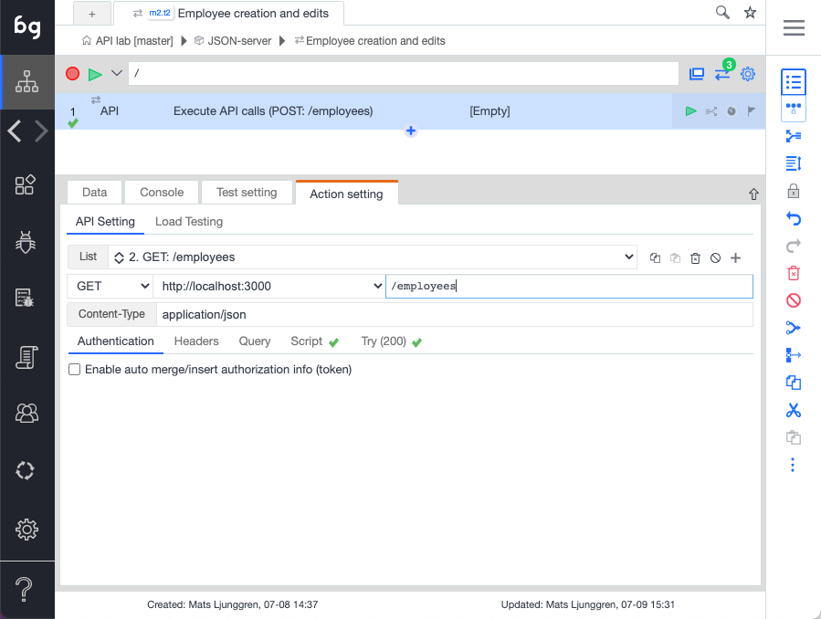

Here, we will insert the id as a query to make sure we fetch the right employee.

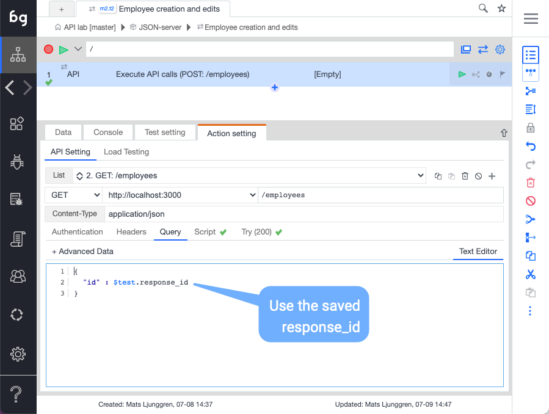

Go to the Try tab and make sure the information is correct.

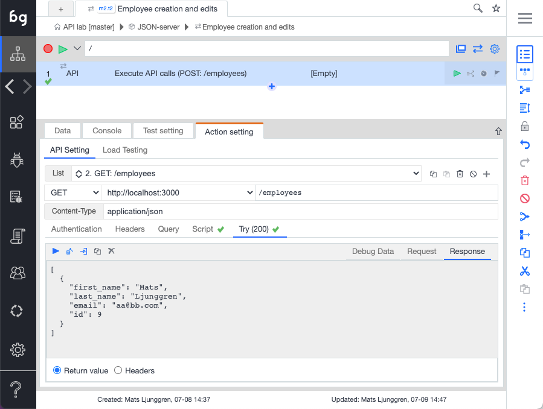


## Second API call: Validating employee information
In this step, we want to validate that the API stored the employee information correctly. We do this by modifying the script in the following way.

```
(()=>{
  console.log("BZ-LOG: ### Result: " + $result.responseJSON.id)
  if ($result.status >201) {
    return false;
  } 
  
  let status = $result.responseJSON[0].first_name === $test.person.firstName &&
  $result.responseJSON[0].last_name === $test.person.lastName &&
  $result.responseJSON[0].email === $test.person.email;
   
  return status;
})();
```

In the tool, it should look like this

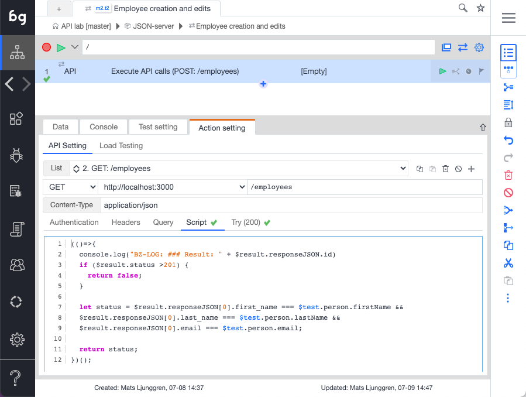

You can now play the test

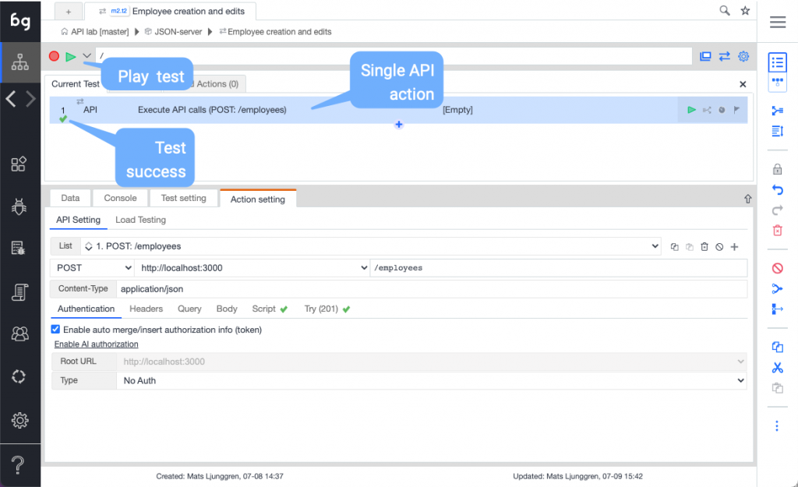

As you can see, there is limited information here. It only shows the green checkmark that the test executed successfully.

To get more information, switch to the report view

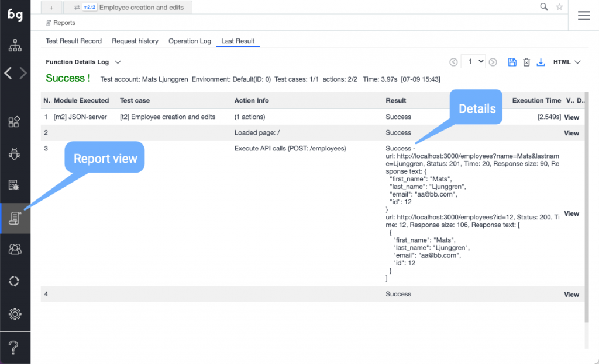

This was an example of how you can create a data-driven test in Boozang that carries over data for validation to a subsequent API call.

## Conclusion
As you can see, Boozang requires some work to get started. Once you have your initial module, it’s fairly straightforward to keep adding API requests and tie them together using data.

As Boozang was designed for end-to-end UI tests, API tests, and a mix of the two, there is some added complexity to work through. The advantage is that having access to the application interface via the browser provides several benefits to the user. Read more about these benefits here: https://boozang.com/blog/advanced-api-testing.