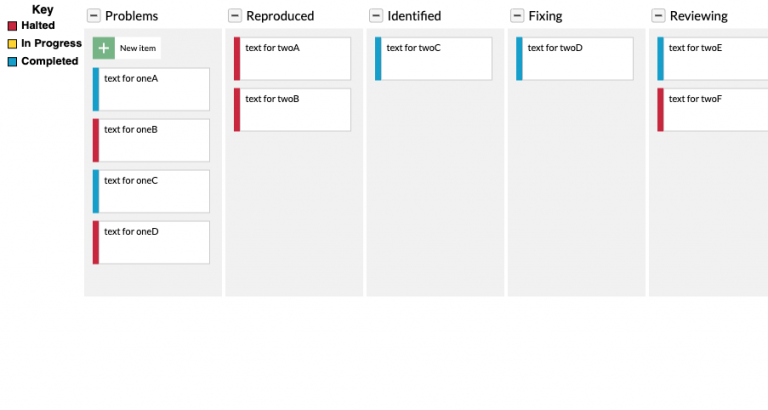
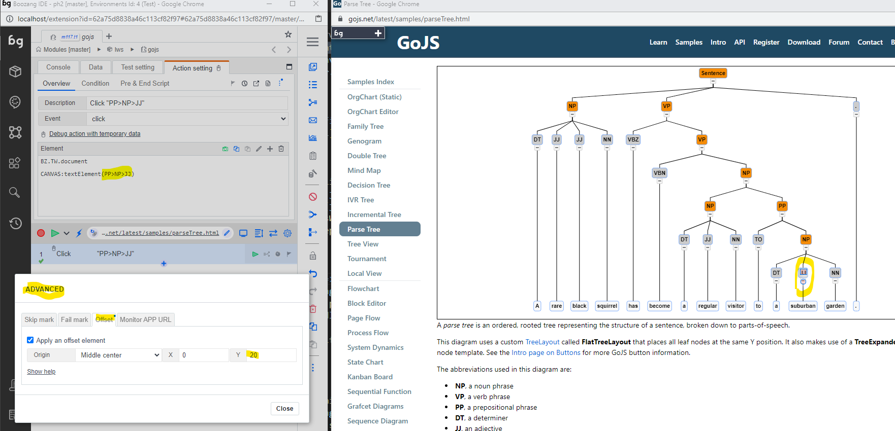

## The HTML Canvas 

Create tests on top of graphical elements in your application using canvas testing. Unlike other methods, Boozang allows us to record clicks and do validations inside the canvas, just like we do on elements in the DOM tree.

Doing testing on top of HTML canvases has always been challenging. The biggest challenge is that the details inside the canvas isn’t exposed in the DOM tree, so regular record/replay tools simple can’t do the job.

## GoJS introduction
We illustrate this with an example using GoJS. This is a versatile library for creating diagrams of different kinds, including

- Flowcharts
- State charts
- Org charts
- Industrial processes

It’s widely used, and has native support for all major Javascript frameworks, including React, Angular, and Vue.

For a complete description of GoJS consult [https://gojs.net/latest/index.html](https://gojs.net/latest/index.html). You can also see a bunch of different diagram samples: [https://gojs.net/latest/samples/index.html.](https://gojs.net/latest/samples/index.html).

## The Kanban board
Take a look at an example of a clickable Kanban board, as shown [here](https://gojs.net/latest/samples/kanban.html).




A Kanban board written in GoJS.

Let’s look at the click of the “New Item”. This is displayed as a HTML canvas element. Looking at the generated code we see that the whole logic has been hidden inside the `<canvas>` element.

```
<canvas tabindex="0" width="1808" height="966" style="position: absolute; top: 0px; left: 0px; z-index: 2; user-select: none; width: 904px; height: 483px;">This text is displayed if your browser does not support the Canvas HTML element.
</canvas>
```

As we cannot manipulate the DOM tree directly, this makes conventional testing methods unusable. Let’s look at some of the existing options out there.

## Existing test methods
So far, there are few options for testing Canvas elements. Usually, you’ll need to do plenty of custom development. In order to interact with the Canvas you’ll need to manually trigger browser events, such as on-click or mouse-down events, which become very sensitive to small changes, such as browser window dimensions. It’s also makes it very hard to automate drag-and-drop events, which is needed for our Kanban example.

More-over, the only way to do validation of the Canvas is to use visual verification. This also tends to create brittle tests, often generating false negatives (false bugs).

To read more about these methods, check below for Selenium and Cypress respectively

- Selenium Canvas testing
- Cypress Visual Testing

In the end, the limited support for Canvas testing usually results in resorting to manual tests, losing important automated test coverage.

## Canvas testing in Boozang
In Boozang we take a quite different approach. Instead of settling for the methods explained below, we are able to look inside the html Canvas element, and record operations on it.


We introduce a new set of selectors called

```
CANVAS
CANVAS:textElement
```

Using these element selectors you can both capture events done on the canvas, such as clicks or drag-and-drop (as in the animation above), and do validations (assertions) on items inside the canvas. This means that instead of having to specify starting and ending coordinates for a drag-and-drop action, we can say drag box with label “Banana” to box label “Apple”.

This means tests become stable to initial conditions changing. It also allows us to do actions and validations inside the canvas, instead of doing actions inside the canvas, and relying to validations outside, which is typical for other approaches.

## Offset



As we match the text content of an element in the HTML canvas, it's sometimes useful to specify a relative offset beetwen the text and where the drag-and-drop should be initiated

## Try it

In order to try different GoJS examples, you can check out [https://gojs.net/latest/samples/index.html.](https://gojs.net/latest/samples/index.html) or our own small Canvas example [https://thelab.boozang.com/canvasGame](https://thelab.boozang.com/canvasGame).

## Summary
Being able to implement different graphical elements using the HTML Canvas element can be really useful. Unfortunately, it often blocks you from doing any meaningful automated testing, forcing you do either change your development approach, or resort to manual testing.

Boozang bridges this gap by introducing a new set of selectors that can look inside the Canvas element, allowing for the creation of sophisticated functional tests.