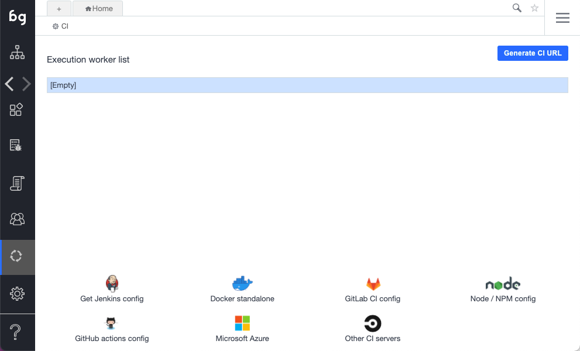

To connect to an external CI server using Boozang, you'll need to use the Docker runner or NPM package described in the previous section. We will automatically generate the script code needed to get this up and running. The script can then be customized to suit your particular setup.

## Generating the integration code

To get started, start by visiting the CI sidebar option in the Boozang tool.

The current options are currently supported

- Jenkins: Use to create boilerplate Jenkins script code based on the Docker Xvfb runner
- Docker stand-alone: Use to create your own Docker-based runner
- GitLab CI config: Boilerplate code based on the Docker Xvfb runner
- Node / NPM config: Develop your own pipeline based on the NPM package Boozang
- GitHub actions config: Boilerplate code based on the Boozang npm package and GabrielBB/xvfb-action@v1
- Microsoft Azure: Sample boilerplate code based on Docker Xvfb runner
- Other CI server: Sample boilerplate code based on Docker Xvfb runner