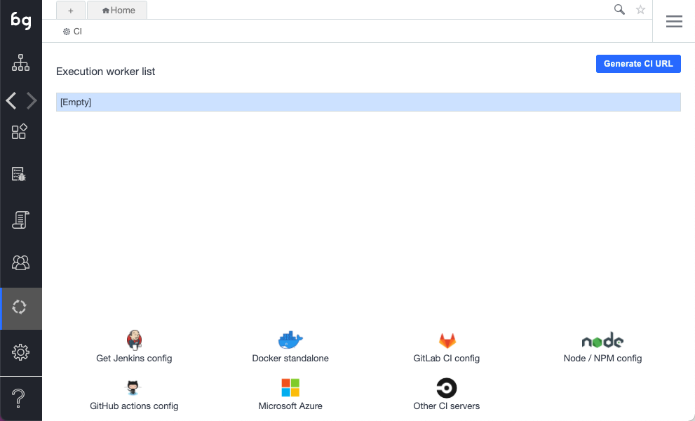

To connect to an external CI server using Boozang, you'll need to use the Docker test runner ([`styrman/boozang-playwright`](https://hub.docker.com/r/styrman/boozang-playwright/)). Boozang can automatically generate the script code needed to get this up and running. The script can then be customized to suit your particular setup.

## Docker Test Runner

The recommended approach is using the `styrman/boozang-playwright` Docker image, which packages Playwright with Xvfb for headless browser execution.

```bash
docker run --rm --shm-size=1g \
  -v "$(pwd):/var/boozang/" \
  styrman/boozang-playwright \
  "https://ai.boozang.com/extension?token=TOKEN#PROJECT/VERSION/MODULE/TEST/run"
```

### Runner Options

| Option | Description |
|--------|-------------|
| `--file=name` | Report filename (default: "report") |
| `--screenshot` | Capture screenshot after test |
| `--video=on\|off\|none` | Video recording mode |
| `--keepalive` | Keep browser alive after completion |
| `--testreset` | Reset test before execution |
| `--width=1280` | Browser viewport width |
| `--height=1024` | Browser viewport height |
| `--loglevel=LEVEL` | Log level (error/warning/info/debug/log) |
| `--device=NAME` | Emulate a specific device |
| `--timeout=SEC` | Command timeout in seconds |

### Exit Codes

| Code | Meaning |
|------|---------|
| `0` | Tests succeeded |
| `1` | Tests failed |
| `2` | Error (invalid URL, missing token, etc.) |

Reports and screenshots are written to `/var/boozang/` inside the container. Mount this path to a local directory to access them.

## Generating the integration code

To get started, visit the CI sidebar option in the Boozang tool.



The following options are supported:

- **Jenkins**: Boilerplate Jenkins script code based on the Docker runner
- **Docker stand-alone**: Create your own Docker-based runner
- **GitLab CI config**: Boilerplate code based on the Docker runner
- **GitHub Actions config**: Boilerplate code based on the Docker runner
- **Microsoft Azure**: Sample boilerplate code based on the Docker runner
- **Other CI server**: Sample boilerplate code based on the Docker runner
