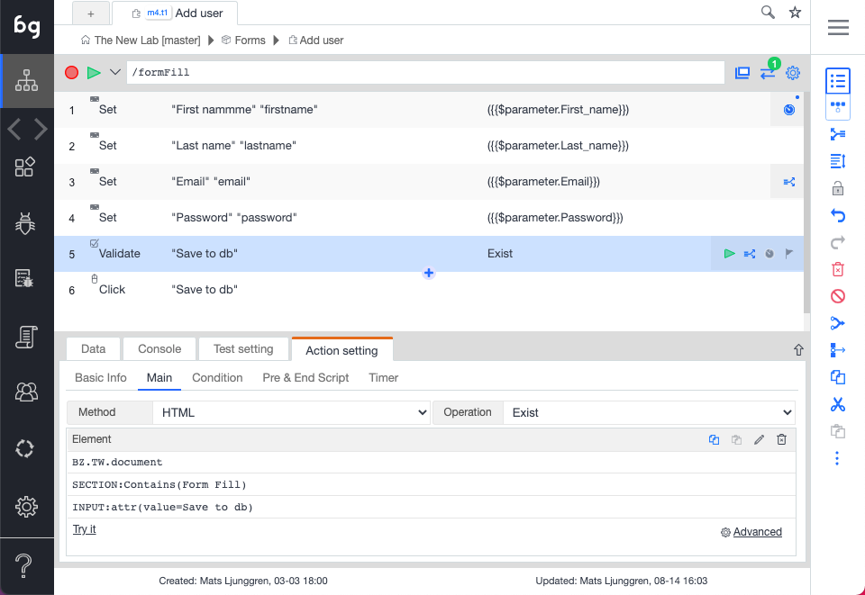

Actions are the steps that comprise a test case. This could be a mouse or keyword event, simulating a user action, or a validation (assertion) or even Javascript. There are also AI actions supported which are more elaborate actions such as "Visit Links" or "Form Fill".

## Events

There are three types of events supported in Boozang: Set, Click, Keypress, and Change. These are fairly straightforward, but not obvious which event will be captured during a recording. See list of events that will be generated for different recording scenarios below.  

- Set events: Generated when filling forms and using drop-downs, even customized drop-downs. Set is an "intelligent" event, and is comprised of a combination of browser events. This allows for single-action recording of customized drop-downs and file dialogs, and is part of the reason Boozang recording can be so powerful. 
- Click events: Generated when clicking buttons or page elements. Not generated when clicking inside a form input, drop-down or on a checkbox. 
- Change events: Generated when filling inputs in forms and clicking mouse, tab, or enter
- Key events: Generated when pressing keys in special circumstances. 

This might seem contra-intuitive, but guarantees that form fills are recorded as stable as possible. Usually, regardless of user habits (using mouse or tab key), forms should be recorded the same way. 

- Set events: The set event is generated in the recording by merging events in the browser acting on the same component. As you can see in the form fill test below, the click events and enter text events have been merged to a single "Set" event. There are some cases where Boozang doesn't manage to create the set event, like in the last mouse click. If this shouldn't be a click, but rather a set (input box, checkbox, or drop-down), it can be switched to a set event afterwards. 

<!--  -->

- Mouse click events: This event corresponds to a mouse action, meaning a click or a movement of the mouse. By default, Boozang captures on clicks in the recording (otherwise the recording becomes very noisy catching too many events). The exception to this is when holding the mouse button down, to emulate drag and drop. In this case, Boozang registers a particular drag-and-drop event.  You can add mouse events manually to emulate mouse-over events and to create specific mouse conditions. 

- Advanced: Here you can add additional validations as a post-condition for an action. 

- Change events: The change event is used to record state change in forms and checkboxes. When filling a form field, the data will be shown in brackets, like

`(John Doe)` or `($parameter.name)` or `($test.name)`

If a checkbox is clicked, the `value` attribute will be shown in the brackets. In the below example

```html
<input type="checkbox" name="vehicle2" value="Car"> 
```

the action will show `(car)` when being checked and blank string when being unchecked.

- Key events: This event corresponds to a keypress. This is captured in the recording for every time a key is pressed. The default recorded keypress is `Group` which will generate the following Javascript events: `keydown`, `keypress` and `keyup`, in that order. You can change the drop-down to generate a specific event only. 

You can also generate a special key or char code by clicking the field and clicking the keyboard button. 

## Validations (assertions)

<!--  -->

- Creating a simple validation: In a test, it´s common to make sure that a certain outcome is achieved. In Boozang, we do this using validation, also known as assertions. To create a validation, click on the validation icon and select the element to validate it in the application window. The default validation content format: "validate exists" will be created. If you want to change the validation content format you can do this using the dropdown in the tool window. 

- Content formats: The following content formats are supported

  - Exists (default): Validates if an element exists. It generates a success condition if the element in the path exists, and a fail condition if it doesn't exist. 
  - Not exists: Opposite to Exists. It generates a fail condition if the element in the path exist, and a success condition if it doesn't exist. 
  - Dynamic Exist: Uses the value of the expectation to determine what it runs. If expectation evaluates to `true`  Exists will execute, if `false`, Not Exists will execute. 
  - innerText: Used for String comparisons of the innerText content of the element. It generates a success condition if match, a fail condition on mismatch and an error condition if element doesn't exist. 
  - Input value: Used to do String comparisons of an input box. It generates a success condition if match, a fail condition on mismatch and an error condition if element doesn't exist. 
  - Is Enabled: Check if an element is enabled. It generates a success condition if the element is enabled,  a fail condition if the element is disabled, and error if the element doesn't exist. 
  - Is Disabled: Opposite of Is Enabled. It generates a fail condition if the element is enabled,  a success condition if the element is disabled, and error if the element doesn't exist. 
  - Is Checked: Checks if a checkbox is checked. It generates success if the element is checked, fail if the element is unchecked, and error if the element doesn't exist. 
  - Screenshot: Does a pixel-by-pixel comparison of an image. After an element has been selected, a checksum is generated of the image content. This action will generate success if an identical image is found at the element location and fail otherwise. An error will be generated if the element doesn´t exist. 
  - Data: Check an element if it contains a set of data. The data expectation can contain several data entries. It generates success if all data is found in any order, fail if any data is missing and error if element doesn't exist. Powerful to check if a table or list have a certain data entry. 
  - Script: Write custom validation using Javascript. Generates success if true is returned and fail if false is returned.
  - Request/Response (API): Does a validation on an API end-point. See section for API testing. 

As you can see, a lot of these commands have three expected results: Success, Fail, and Error. Note how Exists and Not Exists should only be able to return Success or Fail.

- Compare: This is the comparison operator. The following operators are self-explanatory

  - Equals (==) and Not Equals (!=).
  - Greater-than (`>`), Greater-than-or-equals `>=`).
  - Lesser-than (`<`), Lesser-than-or-equals (`<=`).

  and these are a bit more complex

  - regex: Use regular expressions in the Expectation field
  - Include: Checks for any occurrences of a String. It generates success if it finds a match and it will fail otherwise. If the element doesn't exist, it generates an error.   
  - Exclude: Opposite of Include. It fails if it finds a match, success otherwise. If the element doesn't exist, it generates an error.   

**Expectation**

This is the comparison value to use. This could be a string or regular expression (in the case of the regex operator). 

*Advanced (accessible from kebab menu)*

<!--  -->

This is used to pre-process a validation and is useful when filtering out dynamic data. 

Imagine the following example: 

```html
<div>
  The date is 2019-09-12 and I'm feeling good.
</div>
```

In this case, it would be desirable to validate the message itself and that any date is shown, but not a specific date. By setting `Match` and `Replacement String` like

```
Match: ([12]\d{3}-(0[1-9]|1[0-2])-(0[1-9]|[12]\d|3[01]))
Replacement string: YYYY-MM-DD
```

The expectation value for `Validation Equals`becomes

```html
<div>
  The date is YYYY-MM-DD and I'm feeling good.
</div> 
```

This can also be used to make sure sensitive information doesn't end up in any reports or on the Cloud server.

### Validation databind

import YouTubeEmbed from "@site/src/components/YouTubeEmbed";

<YouTubeEmbed embedId="6FMtt6EViyA">Validation databind</YouTubeEmbed>


- Javascript validations

The default validation is HTML validation. By changing the method to "Script", you can directly do validations using Javascript. The Javascript function is written in the standard Boozang format

  `(function(){
    //return true/false;
    })()`

and must return true or false. If an element has been picked with the DOM picker this will be available using the handle `$element`. Standard data handles, such as `$project`, `$module`, and `$test` will also be available, as well as the test window handles `$TW`. For more information about data see <a href="/doc/data.html">data</a> section. 

## Extract data


This is used to extract data from the application window and to store in a data variable. 


<!--  -->

When you add an extract data action, you'll be prompted to select something from the application window. As you can see from the example, data is extracted the following way

```javascript
$test.tmpValue=$element.innerText.trim()
```

This is just an example to help you along. If you have your own data variable, for instance `$project.myHappyData` you can simply replace the code in the `Extract Data` field.

```javascript
$project.myHappyData=$element.innerText.trim()
```

**Dynamic data and element selector**

When selecting some data in a page that is dynamic, such as a database id or project name, it's important to pay special attention to the element. By default, Boozang natural language selectors will try and identify the element by the actual text, which would be changing, generating an element not found error. 

Here it is needed to click on "Edit element" icon to open the DOM picker, and explicitly choose a selector that doesn't contain the dynamic data. In the example below, `tiger` is the dynamic data that was highlighted by default. To extract this data, we have instead chosen to use a selector based on the attribute `class` which should be equal to `string1` (denoted with Javascript shorthand below as `.string1`). 

<!-- . -->


## The Javascript action

Boozang also allows you to execute Javascript directly in the application. This can be very useful when trying to do more advanced things that aren't covered by the set of actions Boozang has out of the box. 

- Syntax highlighting: In Javascript mode, you'll get syntax highlighting, similar to a desktop IDE.

  *Read more in our blog: https://boozang.com/new-feature-code-editor/*

- Debugging Javascript: To debug Javascript, you can add breakpoint directly in the code. This will activate the Chrome browser break-point, and gives you the full capability of the browser debug, such as step forward and inspect data. That means that you'll need to open the browser console to make sure to enable this. 

- Reference Data: When writing Javascript, there are some particularities in Boozang that need to be respected. To access the application window, you will have to use the handle `$TW (test window)`. This means that to manipulate the application window document tree (DOM), the user needs to use `$TW.document`. When referencing the only document, it references the Boozang tool window, not the application window.

In Boozang, you can reference data directly in Javascript. To access data, use the handles `$project`, `$module`, or `$test`, depending on what level the data was added. For instance, to reference a username that was added on the module level, use `$module.username`. 

- Functions: Boozang also supplies pre-made code snippets for the following common scenarios. 

  - Load page
  - Browser back, Browser forward
  - Scroll to Top, Scroll to Bottom, Scroll one page down and right, Scoll one page up and left
  - Retrieve URL

  Use these as-is or as starting points for you own custom Javascript commands. 

- Trouble-shooting: To troubleshoot the application, it's sometimes useful to add debugging code. For instance, to write the contents of the module-level data "username" use `console.log($module.username)` to write it to the tool window and `$TW.console.log($module.username)` to write it to the application window. You can use the Chrome developer tools to verify this.

  *Tip: Avoid using `$TW.alert()` as Boozang interprets this as application popup windows and intercepts them.* 

## Comment

<!--  -->

<YouTubeEmbed embedId="ywuO4zPk3lk">Using Comments</YouTubeEmbed>


- Why use comment: In some cases, errors can only be spotted by a human, such as UI bugs or poor choice of language. In this case, it can be useful to point this out so a team member on the receiving side can correct this. For these cases, we use the Comment action. 

- The Comment action: The comment actions add a comment, or annotation, to the application. To add a comment, click on the Plus icon and select Add Comment, and select the element in the application page to Comment. You can write directly into the Comment dialog on the application.

- Running a test with comments: When running a test with comments, the test will execute and stop at the first comment. To skip to the  next comment, press play again. This is very useful when fixing look & feel issues, as several issues can be recorded in the same test case. 

- Show selection for Pass/Fail: Sometimes it's nice to create a checklist for a manual tester to be guided through the application. You can use the Comment action to ask questions to the user and generate success or failure code based on user inputs. Simple click the "Show selection for Pass/Fail" to generate this kind of interactive comment. 

## Refresh/load page

The refresh window/load page action is used to force a reload of the browser window. This can also be used to force loading a new page (meaning going to a new page without having to navigate to it). There is also an option to **Clear Cookies** and **Clear Localstorage**.

**Note**: There are security limitations for the web browser we cannot get around. For instance, the browser does not allow session cookies to be deleted, so this cannot be triggered by the Boozang tool.

## Visit links

<!--  -->

The visit links action is used to automatically crawl a set of pages based on a navigation bar. To crawl a full navigation panel, such as side navigation or hamburger menu, select this in the **Panel** option. **Target element** defaults to "A" tags but can be changed using the DOM picker in case the navigation contains a different element than regular links. It's possible to execute a script before each click, but this can normally be left blank.

For each click, it´s normal to call a test case. Use **Goto Test Case** to select a downstream test case. This test case will be called for each link in the selected navigation panel.
