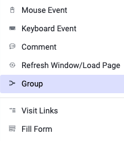
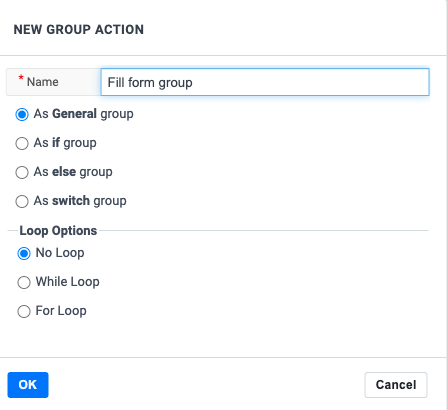
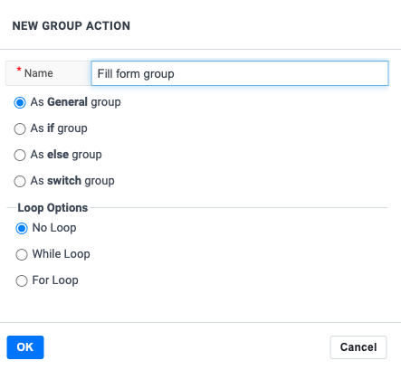
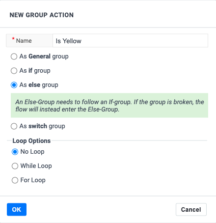
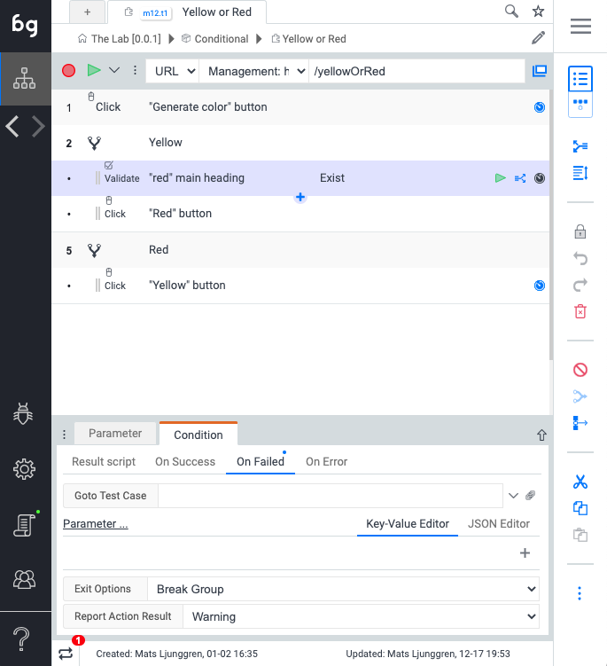
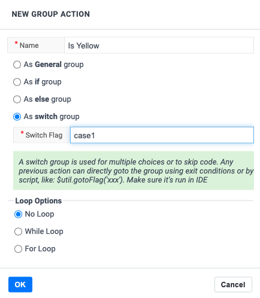
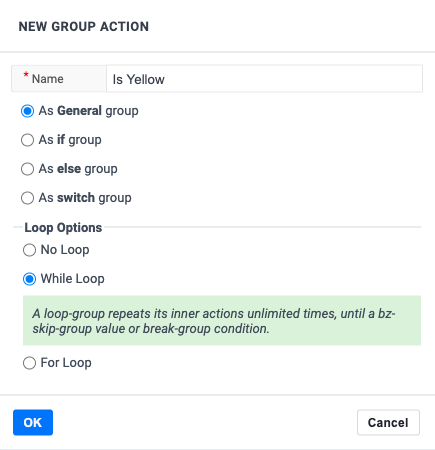

 ## Loop data view

This execution view is useful when looping over spreadsheet data or similar. This is not only useful for test automation, but for robot-process automation use-cases,
like data provisioning.

import YouTubeEmbed from "@site/src/components/YouTubeEmbed";

<YouTubeEmbed embedId="zHDmcl2pIh0">Loops</YouTubeEmbed>

## Groups

This post explains the changes we made on groups to simplify handling logic and loops. We introduce group types that guide the user when solving more advanced test automation challenges. 

### Adding a group



There are two ways to add a group. To add an empty group, use the add action button and select More actions -> Group. You can also select existing actions and use the Add group in the sidebar. This way, a group is added with the actions inside. The second method is powerful when refactoring a recorded test.

### Breaking out of a group

Group in it’s simplest form is used the same as a code block is used in programming.
```
{ ... }
```

Similarly, as we might use the break keyword in javascript, you can use the exit condition break group in Boozang.

### Different functions of a group




A group can serve many purposes. We provide templates for you to build the following logic

- If-condition
- Else-condition
- Switch-conditions
- While-loops
- For-loops

One difference from programming is that we also support combinations of logic and loops, but this is not a very common use-case, so we will not discuss this in detail. 

### Logic: If-condition




The most fundamental condition is the if-condition. We support two basic if-conditions, either using a script validation or an element validation. 

This condition is useful when you want to do a set of actions, depending on a specific condition or not.

### Logic: Else-condition



Equally fundamental is the Else-condition. Use this condition combined with an if-condition to capture all other cases that the if-condition misses.

### If-Else example



Look at the following idealized example where an if-else condition might come in handy: Red or Yellow, for the Boozang testing ground TheLab.

As you can see, the user to click the Red button when the message “Red” is displayed, and the Yellow button when the message “Yellow” is displayed. Otherwise, an error message is shown. See below example of how to solve this using the If-Else construct in Boozang.

### Logic: Switch



We have also added a switch example. It’s very similar to Javascript as it supports choosing between many different outcomes. We solve this by introducing a flag on different groups. You can now “skip forward” to the block with the right flag, either by using the Javascript function:

```$util.gotoFlag("flag_name")```

Or by setting it on an action’s exit conditions.

### Switch example

Below is an example where we use a switch-statement to jump to three different outcomes

### Loops: For-statement


Just as in programming, we can use groups to emulate the for-statement. We support two different for-loops, one that repeats the group N number of times and one where we loop over elements of a vector or the rows of a CSV. 

Technically in Boozang, we use the group-loop construct. To access the values that are being populated, you need to use the $group-handle.

### Example using For

To illustrate the use of For, we look at a simple todo-list

To add several items to the todo-list, we can use the

In this example, we loop over the vector

```["Pay rent", "Clean the house", "Feed the cat"]```

to add some chores to a Todo-list application. 

### Loops: While-statement



Sometimes it’s also useful to repeat a set of actions until a specific condition holds. Boozang implements this by looping a group an unlimited amount of times until the break group condition happens. 

Example using While

One example where this construct is useful is when cleaning up data. Looking at the todo-list example, we can use this to clean the list. Place the delete item action inside the while-loop and exit the loop as soon as there are no more delete-buttons available. As we know that the delete action will fail when there are no more delete button available, we can customize this exit condition to exit the group (and report as successful).

### Error handling

We have also added error handling to groups. Similar to programming, where you can add a 
```
try {...}
catch (e) {...}
```
you can similarly use a group. Let’s say you have a form fill, and if anything goes wrong in the form fill, stop filling the form and continue the test. Put all the form fill actions in a group and handle the errors on the group’s exit conditions. 

Example of Error handling

Take a look at the following form fill example.

By putting these actions in a group, they become tied to each other. As you can see from the execution, a single action that fails will fail the whole group. I have created an exit condition override on the group level to convert failures to warnings. This way, even though the form wasn’t submitted, the test can continue executing. 

### Conclusions

We have seen from some simple examples of how group, exit conditions, and flag can emulate all common constructs in programming. We added the group types to help the user use these constructs and make fewer mistakes. We hope that you will find the group types helpful. 

## Looping a test

A loop means to repeat execution until a certain condition is fulfilled. In Boozang, a data loop is like a for-condition running over a data set, meaning the test gets executed once for each data entry. 

<YouTubeEmbed embedId="0C-mJGLBGb0">Loop over test case data</YouTubeEmbed>

<!--  -->

To set a test to loop over a set of data (to repeat its execution for each data entry), click on the first line of the test (denoting the test settings) and click the Kebab icon -> Advanced. In "Loop data" select the data you want to loop over. The test will be run once for each data entry, and the current data entry will be available in the `$loop`handle. 

The following data formats are supported to drive loops

- CSV: The assigned `$loop` item will be of `Object` format (JSON) 
- Arrays:  The assigned `$loop`item will be of `Property` format (String) 
- Request data: This is supported if the fetched data is `CSV`or `Array`.

### Looping an action

We also support looping a single action. In the "Pre/End script" tag you can either add an array to loop over the values, or add a single integer to loop a fixed set of times. If you choose to loop over data, the value will be assigned to the `$action` variable.

```
["apple","banana","pear"]: loop 3 times, $action will get the value "apple", "banana", "pear"
5: loop action five times
```

### Looping over CSV data

Boozang supports looping over CSV data, both in the Cucumber/Gherking domain (via Examples) and test domain.

<YouTubeEmbed embedId="8i8ZykTqd1Y">Looping over CSV</YouTubeEmbed>

## Switch (case)

Boozang also supports Switch statements using the flag concept. This allows you to skip over test steps until a test step, where a certain flag is found. 

This utility function used is: `$util.gotoFlag("{name of flag"}`

You can add a flag to a test step by clicking the "flag" icon in *Action Details* tab, and enter the name for the flag.

<YouTubeEmbed embedId="Gj9yAf6KG-w">Switch (flag)</YouTubeEmbed>


