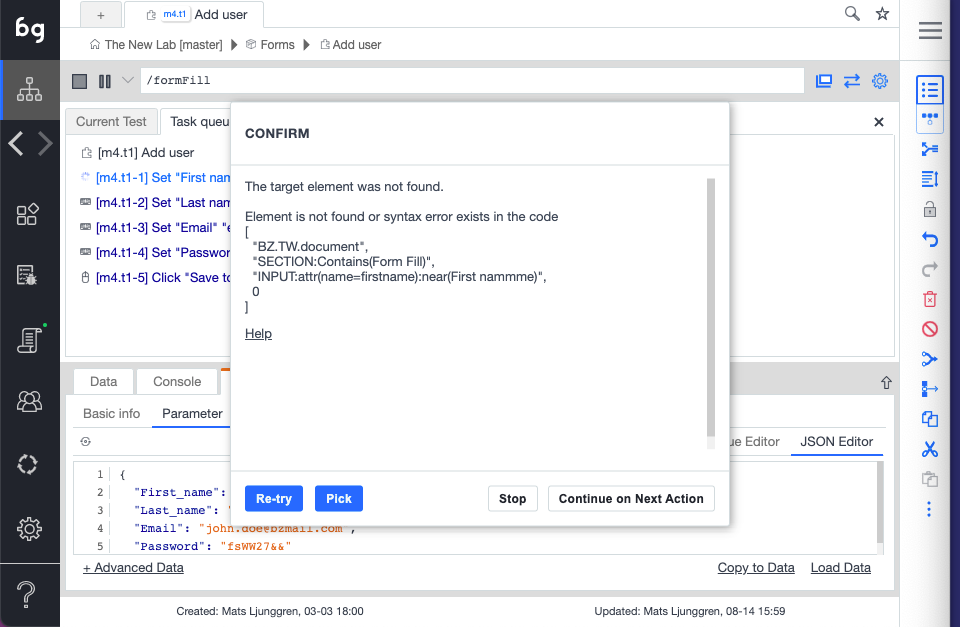

When a test is run and an action element cannot be found the AI test repair screen will be launched. This will allow the user to re-pick the element from the application window. If a matching element is found, Boozang will suggest the element for the user. This allows the user to repair tests ultra-fast even when there have been significant code changes.
