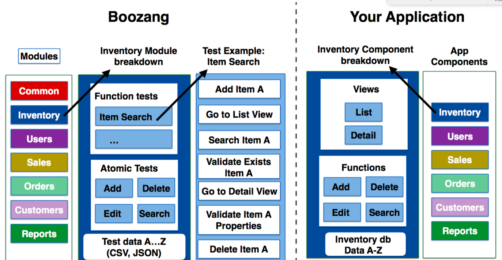
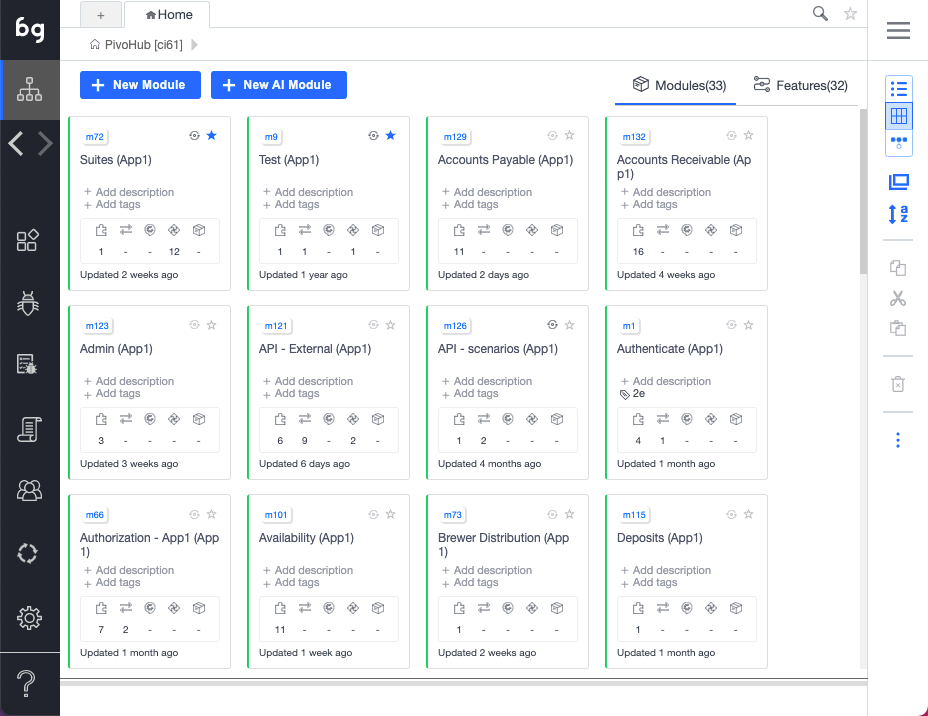
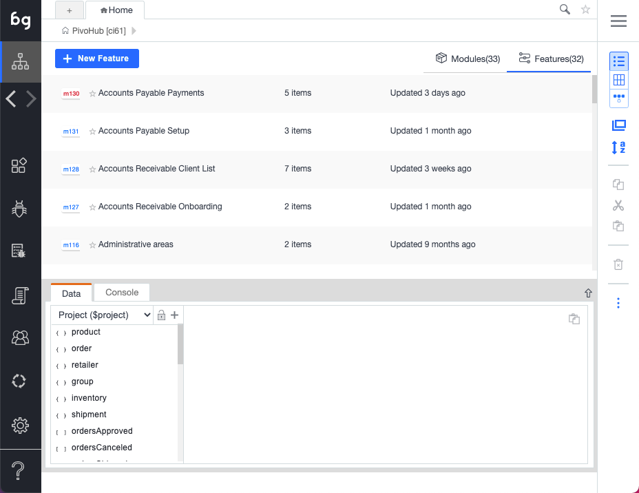

## Object-Oriented testing

Boozang takes an object-oriented approach to testing. Just like your application can be divided into modules and sub-modules, so can your tests. It takes some experience to make the perfect test break-down, and it´s different from application to application. Usually, it´s best to try and mirror the components, or modules, of the application in the Boozang tool. The below image gives an example of this

### Modules

Modules are the primary way to organize your tests in Boozang. They map directly to the functional areas of your application — think of them as the top-level sections a user would see in your navigation. Where other tools have separate concepts for "tests" and "test suites," Boozang unifies these: a test suite is simply a test that calls other tests (using Plug test-case).

Modules serve two purposes:

1. **Organization** — Group related tests together so they're easy to find and maintain.
2. **Data scoping** — Each module can hold its own test data. For example, an Inventory module would store inventory-specific test data as Module data, keeping it isolated from other modules.

### Creating a module

To create a module, click the "+" button in the project tree and select "Module." Give it a name that matches the corresponding area of your application. You can drag and drop modules to reorder them, and nest them to create sub-modules.

### Best practices for module structure

- **Mirror your application** — If your app has sections like Dashboard, Settings, and Reports, create matching modules.
- **Keep it shallow** — Two levels (module → test) is usually sufficient. Only add sub-modules when your application genuinely has that depth.
- **One responsibility per module** — Each module should cover a distinct functional area. If a module grows too large, split it.
- **Use module data** — Store test data at the module level rather than hard-coding it in individual tests. This makes tests reusable and data easier to maintain.

### Sub-modules

For very complex applications it can sometimes be useful to introduce sub-modules. This is particularly useful when you have sub-modules on the application side. For most SaaS applications, such as CMS (content management system) or ERP (Enterprise resource planning), the application is organized in two levels, making the project-module-test hierarchy sufficient.

### Features

Features in Boozang correspond to Cucumber feature files. They provide a business-oriented view of your tests, written in Gherkin syntax (Given/When/Then). While modules reflect the technical structure of your application, features reflect user-facing requirements.

In Boozang, try and create a module structure that matches the application under test. If using Cucumber, you should also try to create features that are aligned with the ways of working in the business domain. Usually, this is a less technical view, focused on requirements and end-user impact.

### Modules vs. Features

| Aspect | Modules | Features |
|--------|---------|----------|
| **Perspective** | Technical (how the app is built) | Business (what users need) |
| **Organization** | By application area | By requirement or user story |
| **Language** | Test actions and code | Gherkin (Given/When/Then) |
| **Data** | Module-scoped test data | Scenario-level examples |
| **Best for** | Developers and QA engineers | Product owners and stakeholders |

You can use both together — organize your tests in modules for day-to-day work, and link them to features for traceability back to business requirements.
