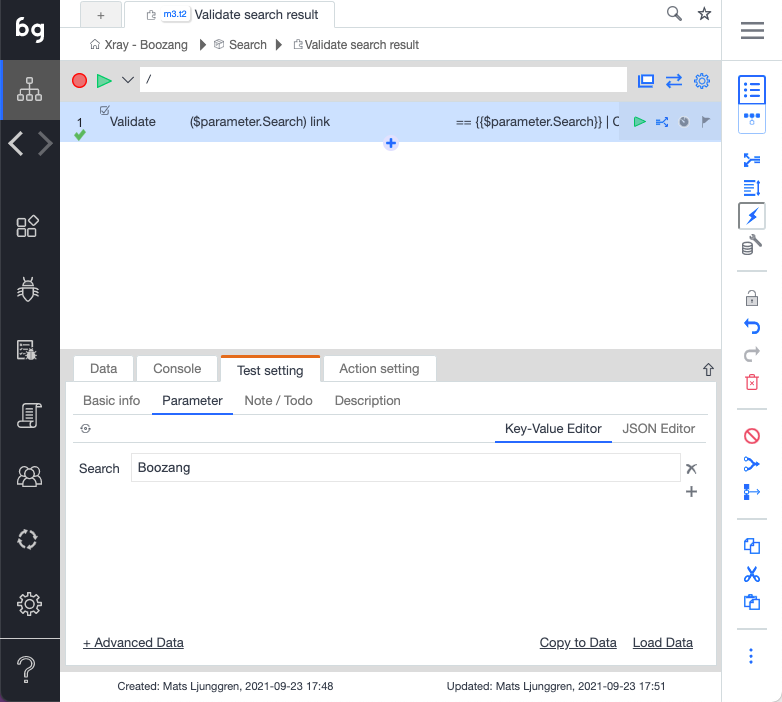

import YouTubeEmbed from "@site/src/components/YouTubeEmbed";

<YouTubeEmbed embedId="504rY6KPBA8">Docusaurus green</YouTubeEmbed>

Now it's time to implement the test steps. Try to make the test step implementation as short and re-usable as possible. 

1. Go to the project root
2. Click "Modules" ("code domain")
3. Create Module ("Search")

4. Create test ("Navigate to Google")

5. Make sure the URL is right. This test can be left blank.

6. Create test ("Search Google")

7. Record a test doing a simple Google search
8. Make sure you are using `$parameter.searchTerm` as parameter to make it data driven
9. Pick some good value to be the default search term ("Boozang")

11. Create  validation test case for the "Then" condition

12. Now you should have a search module with the following tests

