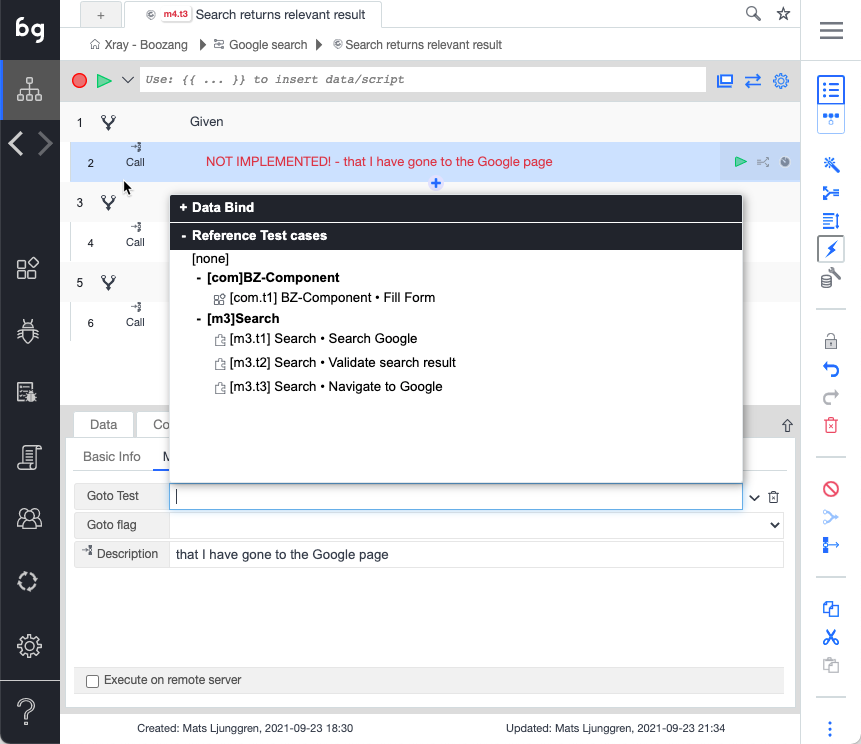

import YouTubeEmbed from "@site/src/components/YouTubeEmbed";

Now it's time to link all the tests. Make sure all the test steps in every scenario goes from "red" to "black".

1. Click on a test step marked as "NOT IMPLEMENTED"
2. Link the test step using the drop-down

3, Link all test steps until they go from "red" to "black"

<YouTubeEmbed embedId="YcCw6cS7Uy0">Docusaurus green</YouTubeEmbed>
bananna
