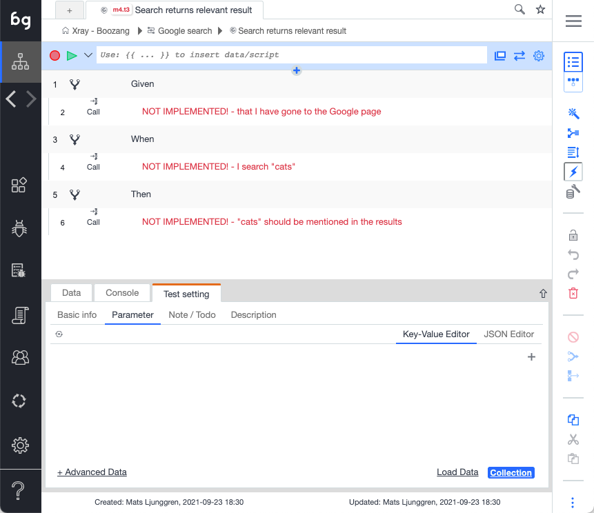
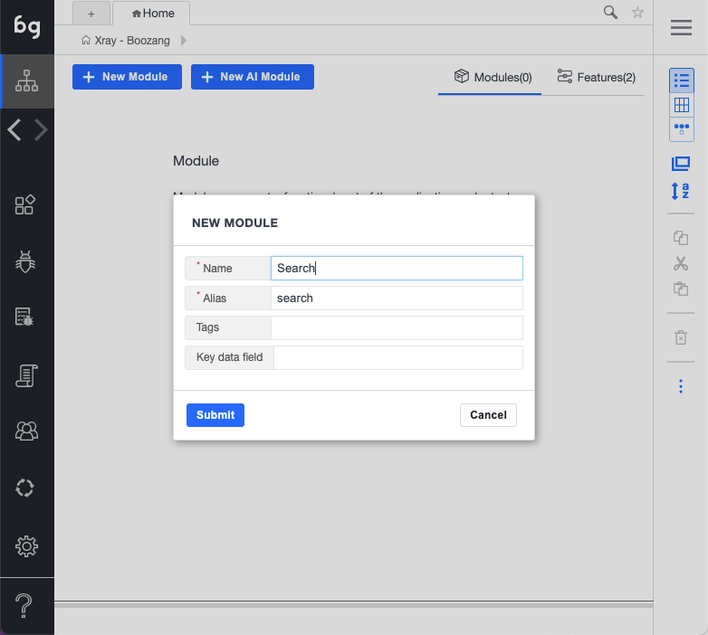
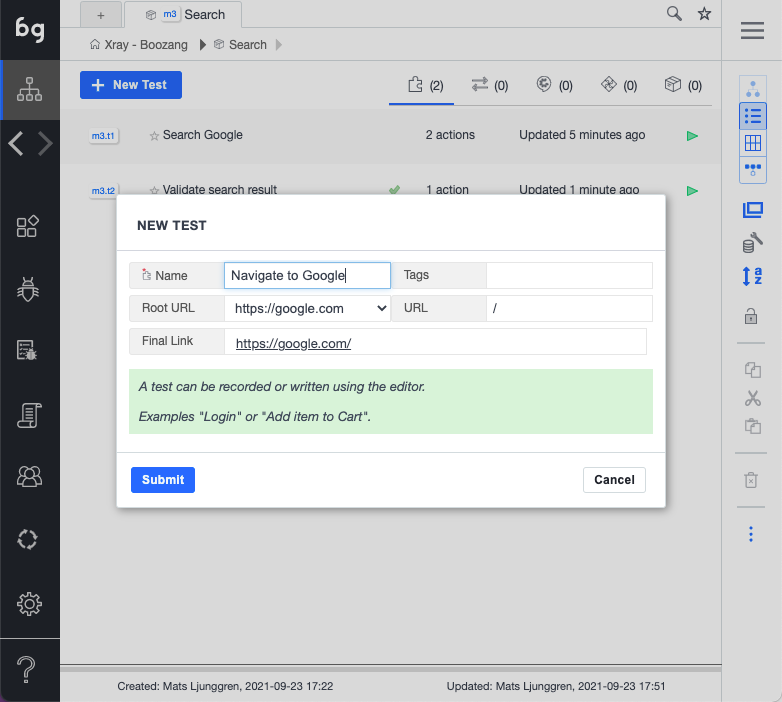
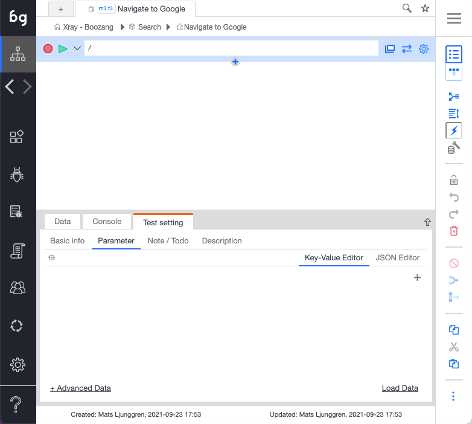
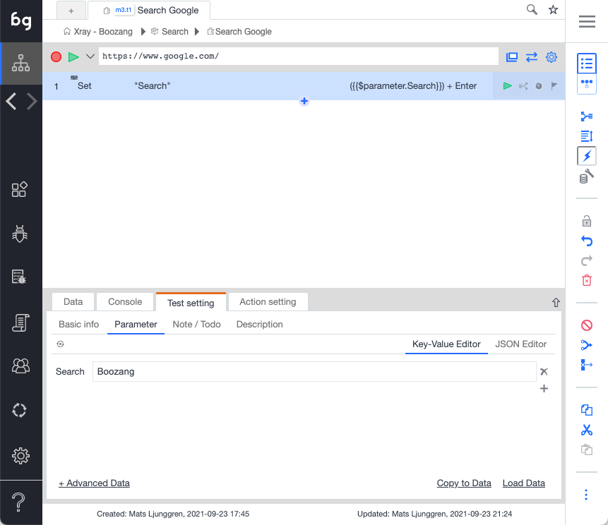
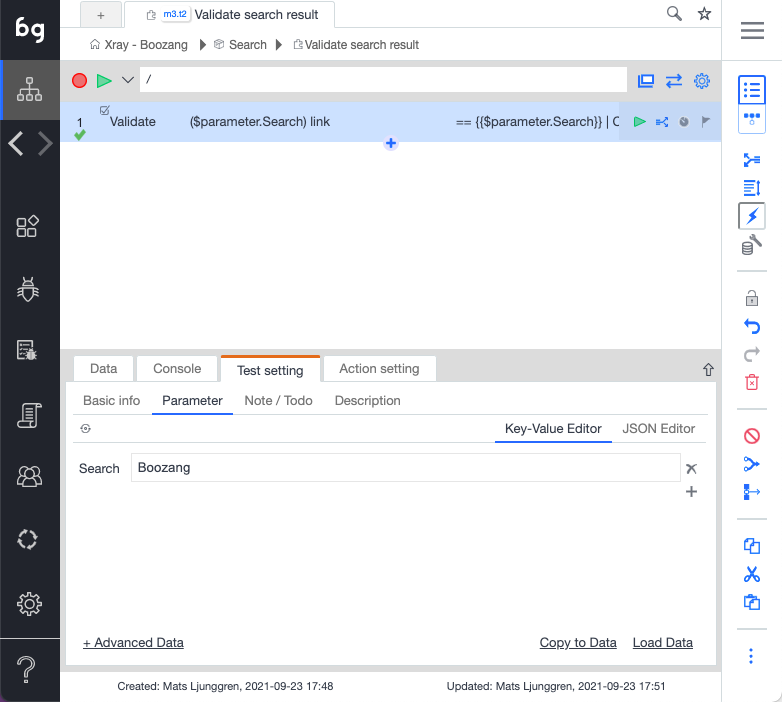
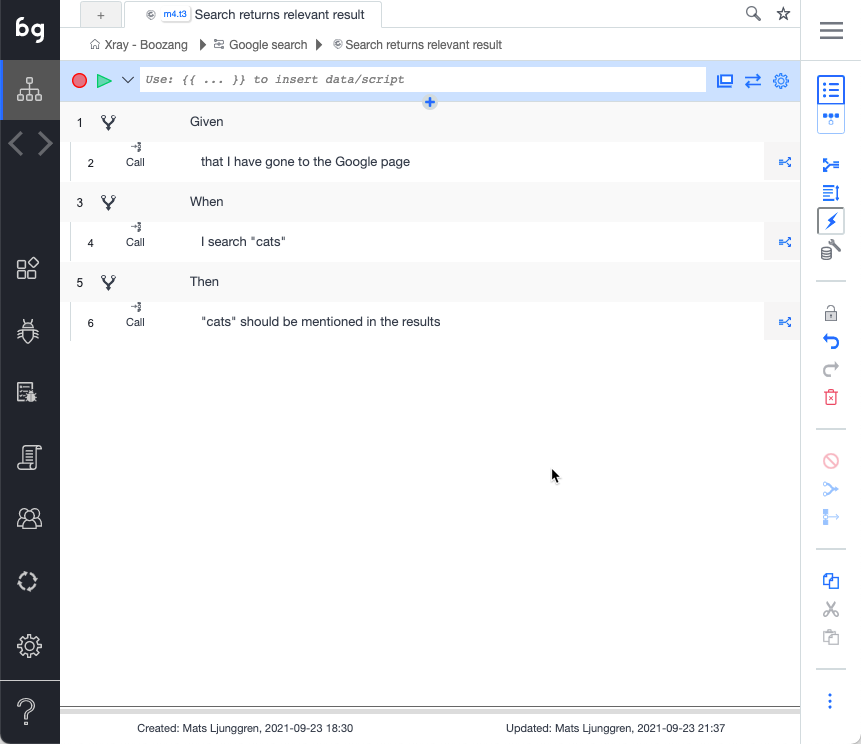

## Introduction

import YouTubeEmbed from "@site/src/components/YouTubeEmbed";


Let's jump directly to a hands-on example, where we define an End-to-end search scenario. In this example we use Cucumber scenarios to drive tests in Boozang. This is not mandatory, but it has many advantages, and it's the recommended test approach in Boozang.

We need to do the following steps in this example

1. Define a Feature file with two Scenarios, where one is data-driven (Scenario Outline)
2. Import the Feature file to Boozang
3. Implement tests for each Sceanario test step
4. Link each test step
5. Dry-run the test
6. Run the test on a CI server

*Note: If you want to do the same test in a non-Cucumber way, simply define a test suite and link the tests together, or merge the actions to a single test.*

<YouTubeEmbed embedId="7jNc2kpdMEo">Docusaurus green</YouTubeEmbed>

## Defining a feature file

We start by defining a feature file that describes a simple Google search.

```gherkin
Feature: Google search
	When I go to the Google search page, and search for an item,
	I expect to see some reference to that item in the result summary.

Scenario: Search returns relevant result
	Given that I have gone to the Google page
	When I search "cats"
	Then "cats" should be mentioned in the results

Scenario Outline: Search returns relevant result - data-driven
	Given that I have gone to the Google page
    When I search <searchTerm>
	Then <searchTerm> should be mentioned in the results

Examples

|searchTerm|
|cats      |
|dogs      |
```

## Importing the feature file

It's now time to import the file to Boozang. You can import the feature file contents using copy paste or import the feature file via the file dialog. You can also use an external system, such as GitLab, GitHub, or Xray to import the feature files directly. 

1. Go to the project root
2. Click the kebab menu (...)
3. Select how to import the file contents (By text, By file, Sync from server)


4. Copy-paste the content of thefeature file above 
5. Click "Load". When browsing a scenario you should see the following



## Implementing the test steps

<YouTubeEmbed embedId="504rY6KPBA8">Docusaurus green</YouTubeEmbed>


Now it's time to implement the test steps. Try to make the test step implementation as short and re-usable as possible. 

1. Go to the project root
2. Click "Modules" ("code domain")
3. Create Module ("Search")



4. Create test ("Navigate to Google")



5. Make sure the URL is right. This test can be left blank.



6. Create test ("Search Google")


7. Record a test doing a simple Google search
8. Make sure you are using `$parameter.searchTerm` as parameter to make it data driven
9. Pick some good value to be the default search term ("Boozang")



11. Create  validation test case for the "Then" condition



12. Now you should have a search module with the following tests


## Linking the test steps

Now it's time to link all the tests. Make sure all the test steps in every scenario goes from "red" to "black".


1. Click on a test step marked as "NOT IMPLEMENTED"
2. Link the test step using the drop-down


3, Link all test steps until they go from "red" to "black"




## Dry-run the test

Now it's time to dry-run the test. Press play and make sure the test executes successfully.

