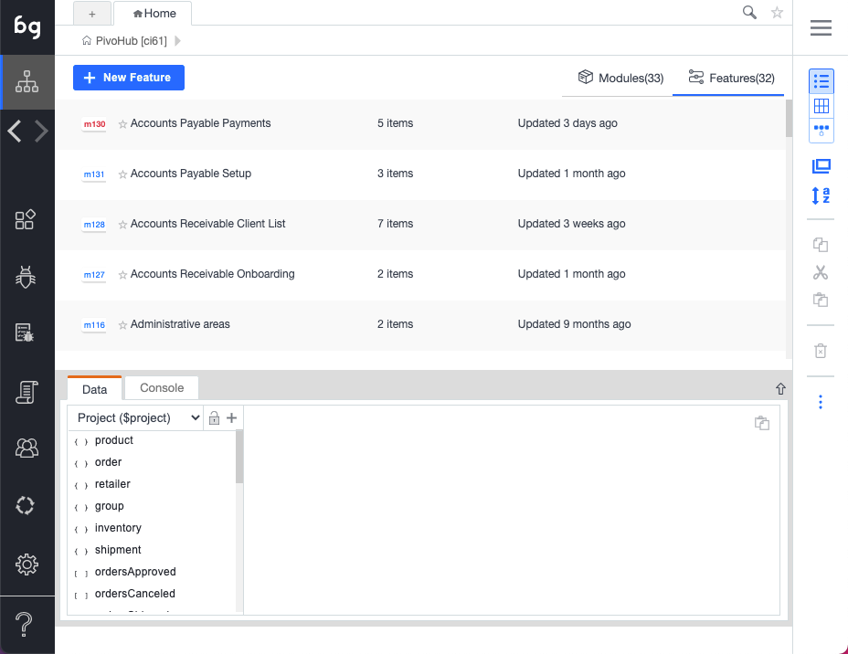

## Object-Oriented testing

Boozang takes an object-oriented approach to testing. Just like your application can be divided into modules and sub-modules, so can your tests. It takes some experience to make the perfect test break-down, and it´s different from application to application. Usually, it´s best to try and mirror the components, or modules, of the application in the Boozang tool. The below image gives an example of this

## Modules

The modules are used to divide your tests into functional areas of your application. Where other tools usually have tests and test suites, or test suites are just another test in Boozang (using Plug test-case). Modules are used to organize tests to match the functional modules of the application. They work as folders to organize your tests, but also to allow data to be added on the module level. For instance, in the Inventory module in the example, the Test data for inventory should typically be saved as Module data. 

## Sub-modules

For very complex applications it can sometimes be useful to introduce sub-modules. This is particularly useful when you have sub-modules on the application side. For most SaaS applications, such as CMS (content management system) or ERP (Enterprise resource planning), the application is organized in two levels, making the project-module-test hierarchy sufficient. 

## Features

In Boozang, try and create a module structure that matches the application under test. If using Cucumber, you should also try to create features that are aligned with the ways of working in the business domain. Usually, this is a less technical view, focused on requirements and end-user impact. 

<YouTubeEmbed embedId="YcCw6cS7Uy0">Docusaurus green</YouTubeEmbed>

