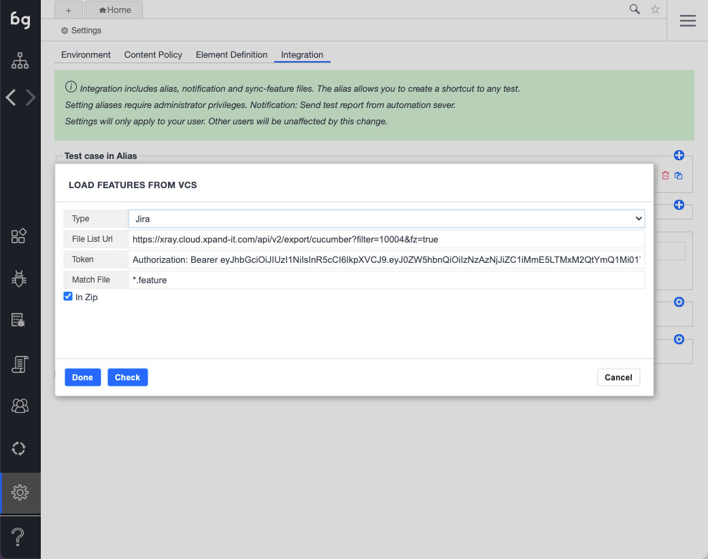

In addition to integrating with CI servers for test execution, Boozang supports loading Cucumber feature files from an external system. This is convenient as it allows teams to keep the Cucumber features stored with the application source code (in the case of GitLab, GitHub, or BitBucket) or as part of the test management life-cycle (in the case of XRay / Jira). 

In this case, Boozang acts as a slave system, which means the master copy of any feature should reside on the external system, and upon synchronization, local changes in Boozang will be lost. 

## Connecting to an external API

To connect to an external API to Boozang, go to Settings -> Integrations. From the dropdown you can select between the following external systems

- Jira / XRay
- GitHub
- BitBucket
- GitLab
- Azure

You will need to generate the access token for the external APIs on the respective sites. Remember, the APIs have a tendency to change, which means that the placeholder we suggest could be inaccurate. If so, simply change the connection URL according to the documentation of the providers and try again.

The following fields need to be entered

- File List URL: The URL end-point to get a list of the feature files
- Token: The authorization header
- Match File: File-match pattern
- In Zip: Check if files are being loaded as a zip

