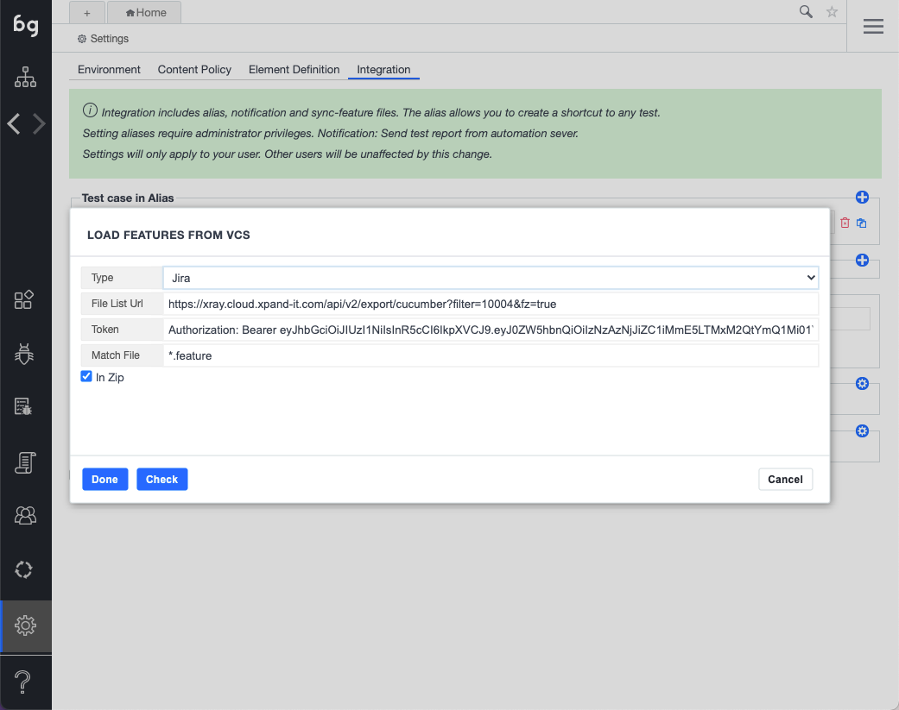

In addition to integrating with CI servers for test execution, Boozang supports loading Cucumber feature files from an external system. This allows teams to keep the Cucumber features stored with the application source code (in the case of GitLab, GitHub, or BitBucket) or as part of the test management life-cycle (in the case of XRay / Jira).

In this setup, Boozang acts as a downstream system — the master copy of any feature resides on the external system, and upon synchronization, local changes in Boozang will be overwritten.

## Connecting to an external API

To connect an external API to Boozang, go to **Settings → Integrations**. From the dropdown you can select between the following external systems:

- Jira / XRay
- GitHub
- BitBucket
- GitLab
- Azure

You will need to generate an access token on the respective platform. The API URLs may change over time, so if the placeholder URL doesn't work, update it according to the provider's documentation.

The following fields need to be entered:

- **File List URL** — The API endpoint that returns a list of feature files
- **Token** — The authorization header value (e.g., `Bearer <your-token>`)
- **Match File** — A file-match pattern to filter which files to import (e.g., `*.feature`)
- **In Zip** — Check this if files are delivered as a zip archive

## Synchronization workflow

1. **Configure the connection** in Settings → Integrations as described above.
2. **Import features** — Go to the Features view and click the sync/import button. Boozang will fetch the feature files from the external system.
3. **Map scenarios to tests** — Each Gherkin scenario maps to a Boozang test. Boozang will create or update tests based on the imported scenarios.
4. **Re-sync as needed** — When features change in the external system, re-import to update Boozang. Any local edits to imported features will be replaced.

## Platform-specific notes

### GitHub / GitLab / BitBucket

For source-code hosted features, the File List URL should point to the repository's API endpoint for the directory containing your `.feature` files. For example:

- **GitHub**: `https://api.github.com/repos/{owner}/{repo}/contents/{path}`
- **GitLab**: `https://gitlab.com/api/v4/projects/{id}/repository/tree?path={path}`

### Jira / XRay

For XRay integration, see the dedicated [XRay integration guide](./xray). XRay provides a richer integration including test execution result reporting back to Jira.
