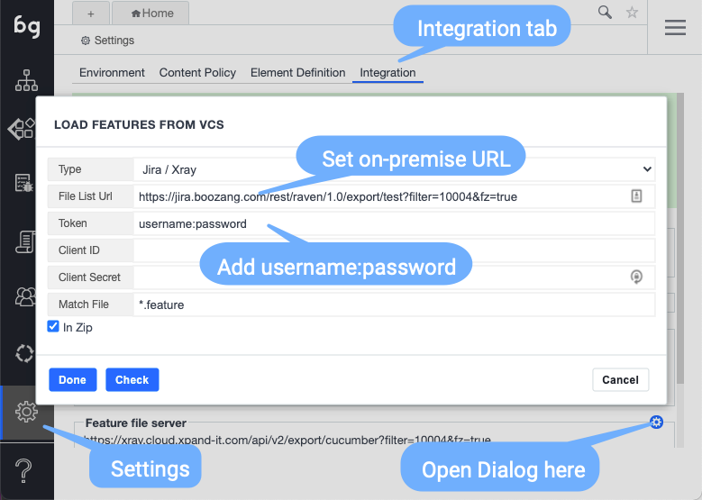
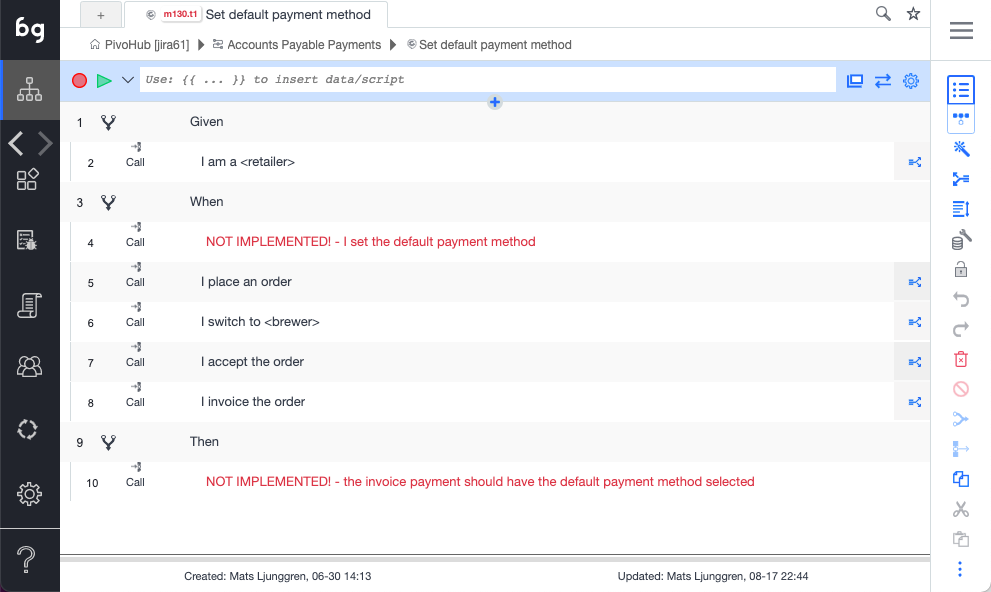

## Xray for Jira


[Xray for Jira](https://marketplace.atlassian.com/plugins/com.xpandit.plugins.xray/server/overview) is a complete, full-featured Atlassian verified test management add-on for Jira. Xray supports both manual and automated tests and a complete testing life cycle: test planning, test designing, and test execution to help developers improve the quality of their systems.

Xray for Jira is an add-on developed by [Xpand Add-ons](http://www.xpand-addons.com/), an Atlassian Solution Partner.

## Concept

Boozang integrates to Xray regardless if you are running Xray on Jira Cloud or Jira on-premise. Xray acts as the source of truth for Cucumber features and test results, while Boozang is responsible for test step implementation and test execution. This way, XRay becomes the main business interface, while Boozang works as the test engine.  

Below is a schematic of how this setup looks using the Jenkins CI server. The connection between Boozang and Xray is independent of the CI server, and the CI server connects directly to Xray to report back the results.


## Integration Steps

These are the steps needed on the Xray side to enable connection with Boozang

1. Get API key (Cloud) or access credentials (on-premise) to allow for XRay integration
2. Define scenarios in XRay
3. Link scenarios to features in XRay
4. Define a Jira filter that matches the desired scenarios

These are the steps needed on the Boozang side to connect with Xray

1. Add the XRay API key to Boozang integrations
2. Synchronize features

These are the steps needed on the CI server side to report results back to Xray

1. Define a Boozang CI job
2. Add the CI step to upload features on XRay

## Xray: Add API key

*Always consult the official XRay documentation for the latest updates and features: https://docs.getxray.app/display/XRAYCLOUD/Global+Settings%3A+API+Keys*

The first thing you want to do is to add an API key to access Xray Restful API. To do this, you'll need to access XRay **Admin view**. You will be able to select "API keys" from the sidebar and click "Create API Key" from the interface.


## XRay: Defining scenarios

XRay and Boozang both support regular Scenarios and Scenario Outlines, so there is a one-to-one mapping between these entities. As a starting point, you will need at least one Cucumber scenario defined in Xray. 

If you don't have a sample scenario handy, you can can find an example scenario sample in our GitHub repository:

https://raw.githubusercontent.com/ljunggren/bz-utils/main/test/cucumber-sample-scenario.txt

Below is an example of a data-driven scenario outline defined on the XRay side. 


## XRay: Linking scenarios to features

The link between Boozang and XRay is done on a feature level, any scenarios to be linked with Boozang will have to be part of a feature. In XRay, this is done by linking issues together. Start by creating a feature in XRay

1. Create - New Feature
2. Link issues -> Is tested by... -> Select scenario to link


## XRay / Jira: Defining a filter

Lastly, to be able to fetch scenarios over the API you will need to define a filter in Jira. 

1. Go to Filters -> Advanced Issue Search
2. Use the JQL to retrieve only automated scenarios


3. Save filter


4. Extract the filter ID from the URL


The JQL for the filter we ended up using in this example was

```JQL
project = Pivo AND issueType = test AND testType = Cucumber
```

## Boozang: Adding the API token

Launch Boozang IDE from the hosting centre of your choice

- Americas: https://ai.boozang.com
- Europe / Asia: https://eu.boozang.com

and create a project if needed. As soon as the project is launched, the Boozang IDE will be launched in the web browser. To setup the integration to Jira / XRay you want to first add the client credentials to be able to retrieve the features from Xray.

The integration view in Boozang can be found at *Settings - > Integrations -> Feature file server*

**For Jira Cloud installation**

In the integration dialog, set the following


1. Type: Set Jira / Xray
2. File List URL: https://xray.cloud.xpand-it.com/api/v2/export/cucumber?filter=10004&fz=true
3. Make sure to set the filter ID to match the filter you setup previously
4. Token: For the Cloud install, this will be generated autyomatically from your credential info
5. Client ID: Set your client id from the Xray API page
6. Client Secret:  Set your client secret from the Xray API page
7. Match file: Leave as *.feature or the file ending you are using

**For Jira on-premise installation**



1. Type: Set Jira / Xray
2. File List URL: Set it to your on-premise API connection URL. 
3. Make sure to set the filter ID to match the filter you setup previously
4. Token: For the on-premise install, you can generate a long-lived token and enter it directly.
5. Client ID: For a hard-coded long-lived token, you can leave this blank. If you rather refresh the token, based on client from the XRay API page.
6. Client Secret:   For a hard-coded long-lived token, you can leave this blank. If you rather refresh the token, based on client from the XRay API page.
7. Match file: Leave as *.feature or the file ending you are using for feature files

After you have entered all access information, check the connection using "Check". On successful connection, the features synchronized should be shown in the UI. Click "Done" to save the configuration.  

## Boozang: Synchronizing features

Boozang now needs to load the features you need from Xray. You can do that the following way

1. Open the project in question in Boozang IDE
2. Go to the root of the project
3. Click the kebab menu


4. Click "Import features"
5. Select "Sync from server"


6. Select features to synchronize


7. Click "Start". The features will now be synchronized with Boozang. 
8. Navigate to a scenario, such as "Set default payment method"
9. You should see all test steps in "Red", as they are unlinked


*Note: If you already have linked test steps, any new test steps with the same exact syntax ((Give I am logged in), will be automatically linked, and will be shown as black.*

## Boozang: Implement the test steps

Now it's time to create the test steps implementation. The test steps are implemented in the code domain of Boozang, which can be found under "Modules" in the root. 

1. Go to the root of the project
2. Go to the "Modules" tab ( as opposed to "Features" tab, which is the business domain, where Cucumber Features and Scenarios live ).
3. Create a new module, for example "Payment".
4. Create a new test, for example "Place an order"
5. Record the steps for this particular test step

*Note: You can also leave this test empty. It will execute successfully by default, and you can worry about the implementation later.*

## Boozang: Link the test steps

It's now time to connect the "business domain" to the "code domain". This is done using a "plug-test case" action, which is the only action supported in a sceanrio.

1. Go to your Cucumber feature
2. Click into the scenario you want to link
3. Use the drop-down to link the scenario
4. After the test has been linked, the test step should go from red to black.

*Note: If it's a data-driven test a Cucumber scenario outline) data will be passed between the "business domain" and the "code domain" using test parameters.*



## Boozang: Test run the scenario

Now it's time to test run the scenario. Boozang supports a number of different play modes. The regular play should be good at this point. 

1. Navigate to the scenario
2. Click "Play" to execute the scenario in the browser
3. Follow the test execution in the execution window 
4. Make sure the scenario executes succesfully end-to-end (or have it fail, if that's what you expect)

## CI: Define a Boozang CI job

As soon as you have implemented some or all tests steps in Boozang, it time to run them on a CI server. 


1. Go to the Root -> Modules ("code domain")
2. Create a new module called "Suites"
3. Create a new test suite ("My payment tests")
4. Define a test suite containing the features/scenarios you need
5. Go to the Boozang CI view


3. Select the CI integration server of your choice, or simply click "Generate CI URL"
4. Generate a CI sample script by selecting the test you need in the CI wizard
5. Enter Boozang password
6. Copy the CI integration script into the CI server of your choice
7. Start a CI test execution and verify the result

*Tip: Use the Cucumber report plugin or similar to make sure you have well-formed Cucumber report files generated.* 

## CI: Upload scenarios on XRay (Jenkins)

Follow the XRay documentation to upload the Cucumber report files.

Jenkins integration for Jira XRay on-premise:

 https://docs.getxray.app/display/XRAY/Integration+with+Jenkins 

Jenkins integration for Jira / XRay in Cloud

https://docs.getxray.app/display/XRAYCLOUD/Integration+with+Jenkins

## Sample integration code for upload of scenarios

To quickly test the upload of scenarios to Xray we build a sample script. This scripts downloads a sample Cucumber report from our GitHub repository and posts it to Xray. The script can be found here

https://raw.githubusercontent.com/ljunggren/bz-utils/main/scripts/test-xray-scenario-upload.sh

It's a simple script that fetches a report file, generates a token from your credentials, and tries to upload the report to Xray.

Option 1 -  run the script contents

```bash
#/bin/bash

# This scripts test integration with Xray and assumes you have defined the following scenario in Jira
# https://raw.githubusercontent.com/ljunggren/bz-utils/main/test/cucumber-sample-scenario.txt

# Make sure you export your client id and client secret as environment variables
# export CLIENT_ID=my-secret-id
# export CLIENT_SECRET=my-secret-secret

# Get report sample file from GitHub
curl https://raw.githubusercontent.com/ljunggren/bz-utils/main/test/cucumber-sample-report.json --output results.json

echo Checking: ${CLIENT_ID} ${CLIENT_SECRET}
echo Checking: curl -H "Content-Type: application/json" -X POST --data '{ "client_id": "'${CLIENT_ID}'","client_secret": "'${CLIENT_SECRET}'"}' 

TOKEN=$(curl -H "Content-Type: application/json" -X POST --data '{ "client_id": "'${CLIENT_ID}'","client_secret": "'${CLIENT_SECRET}'"}'  https://xray.cloud.xpand-it.com/api/v1/authenticate | sed 's/\"//g')

echo $TOKEN

curl -H "Content-Type: application/json" -X POST -H "Authorization: Bearer ${TOKEN}" --data @results.json https://xray.cloud.xpand-it.com/api/v2/import/execution/cucumber
```

Option 2 - download the script and run it

```bash
# This scripts test integration with Xray and assumes you have defined the fo9llowing sceanrio in Jira
# https://raw.githubusercontent.com/ljunggren/bz-utils/main/test/cucumber-sample-scenario.txt

# Make sure you export your client id and client secret as environment variables
# export CLIENT_ID=my-secret-id
# export CLIENT_SECRET=my-secret-secret

# Get report sample file from GitHub
curl https://raw.githubusercontent.com/ljunggren/bz-utils/main/scripts/test-xray-scenario-upload.sh --output test-xray-scenario-upload.sh

chmod +x test-xray-scenario-upload.sh

./test-xray-scenario-upload.sh

```

To use the script, you first have to set your Xray API credentials as environment variables in the shell you are using (for instance - the Jenkins "Execute Shell" step). 

```bash
export CLIENT_ID=my-secret-id
export CLIENT_SECRET=my-secret-secret
```

If you want to try it with different execution status (Pass, Fail, Not Implemented)

```bash
# Get report sample file from GitHub (success)
curl https://raw.githubusercontent.com/ljunggren/bz-utils/main/test/cucumber-sample-report-success.json --output results.json

# Get report sample file from GitHub (failure)
curl https://raw.githubusercontent.com/ljunggren/bz-utils/main/test/cucumber-sample-report-fail.json --output results.json

# Get report sample file from GitHub (not implemented)
curl https://raw.githubusercontent.com/ljunggren/bz-utils/main/test/cucumber-sample-report-not-implemented.json --output results.json
```

See below sample from XRay

