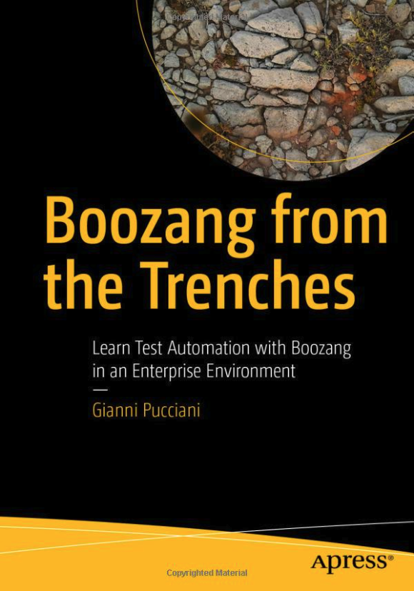

The book “Boozang from the Trenches” is now available on the [Apress](https://link.springer.com/book/10.1007/978-1-4842-9010-1) site and [Amazon](https://www.amazon.com/Boozang-Trenches-Automation-Enterprise-Environment-ebook/dp/B0BQV91G8Z/ref=sr_1_1?crid=3FF9LZE477M55&keywords=boozang&qid=1672079538&sprefix=boozeng%2Caps%2C219&sr=8-1).

The book idea is to complement the documentation already available here with real life examples and practical tips on automating end to end scenarios in an enterprise context.

## Interview with Joe Colantonio

The author, Gianni Pucciani, did an interview with Joe Colantonio about the book. 

import YouTubeEmbed from "@site/src/components/YouTubeEmbed";

<YouTubeEmbed embedId="24Ae5S_3qts">Boozang from the trenches</YouTubeEmbed>

[00:01](https://www.youtube.com/watch?v=24Ae5S_3qts&t=1) Gianni discusses his new book Boozang from the Trenches and his experience with test automation.

[02:15](https://www.youtube.com/watch?v=24Ae5S_3qts&t=135) Struggle with maintaining test automation code

[07:09](https://www.youtube.com/watch?v=24Ae5S_3qts&t=429) Comparison of Boozang with another codeless tool

[09:45](https://www.youtube.com/watch?v=24Ae5S_3qts&t=585) Test automation is an accelerator, not a magic solution

[14:27](https://www.youtube.com/watch?v=24Ae5S_3qts&t=867) Real world examples of test management struggles and solutions

[16:50](https://www.youtube.com/watch?v=24Ae5S_3qts&t=1010) Recording known issues in automation saves time and allows focus on new failures.

[20:47](https://www.youtube.com/watch?v=24Ae5S_3qts&t=1247) Bidirectional synchronization with X-ray and Boozang

[23:02](https://www.youtube.com/watch?v=24Ae5S_3qts&t=1382) Automation testing allows parallel execution for faster speeds.

[27:17](https://www.youtube.com/watch?v=24Ae5S_3qts&t=1637) Modularity is the key to successful test automation.

[29:18](https://www.youtube.com/watch?v=24Ae5S_3qts&t=1758) Test Guild Automation Podcast aims for end-to-end full-stack automation

-----------------

## Summary

Test Automation is a key aspect of delivering high-quality software and reducing time to market. Several tools and approaches are available today, each with its own constraints and specificity. This book introduces Boozang, a codeless web automation tool, using a real-life enterprise project  as source for examples. 

You'll have the opportunity to learn the basic features of Boozang and how to implement end-to-end automated scenarios, mixing GUI and API actions. Integration with JIRA-XRay and Jenkins is also covered to show how Boozang can be used effectively in an enterprise environment. The book is filled with examples that go beyond the Boozang tool, and cover the setup of a test automation project in a real context, with practical solutions as well as open points for which we are still looking for new ideas. 
You will learn how to:

·         Install and set up a project with Boozang

·         Create a modular test suite and use Gherkin to define scenarios

·         Integrate Boozang with JIRA-XRay and work in a team with code branches

·         Build a Jenkins pipeline to execute the automated scenarios nightly and reduce the execution time via parallelism
 

## This Book is for

Testers and test managers, IT projects leads, Release and Delivery Managers, Developers, and Business Analysts