## Note on pricing

We are really excited to announce that Boozang now provides unlimited API testing for FREE so I’m reposting some relevant blog posts.

## Overview

By introducing a new set of API testing features in Boozang, we provide a single browser-based solution for both API and UI tests, allowing for a unified testing process based on Cucumber / BDD, fully integrated to JIRA / XRay.

## Background
Most people will agree that Postman stands out as the option most people will turn to when it comes to API testing. It’s easy to get started and relatively user-friendly. For more extensive end-to-end tests, we have found some limiting factors where Postman falls short.

These include

- Mixing UI tests and API tests
- Creating API tests suites where data is carried forward between the API calls
- Creating BDD / Cucumber API tests
- Integration to external systems, such as JIRA / XRay
- Using the UI interactions to facilitate API test creation

In Boozang, we support all these use-cases. But we still lacked ease-of-use and debugging capabilities. In our latest feature release, we have tried to improve this significantly.

We have also launched features that will allow you to easily migrate between other tools, such as Postman and JMeter. This way, it opens up for collaboration within an organization where different tools are used. Also, it greatly mitigates any lock-in concerns.

## API data model
A note on test types
In Boozang, two of our test types supports API calls

- Regular tests
- API tests

The only difference is that Regular tests can consist of both UI actions and API actions, while API tests cannot do UI actions. It’s therefore recommended that you use regular tests for mixed UI and API tests and API tests for pure API tests. 

For flexibility, both test types support Javascript, Group, and Plug-test case actions.

Note: Nothing would stop you from using only regular tests, but for housekeeping purposes, we recommend that you utilize the API test type if you know you will not be adding UI interactions.

### Modules
To create an API test, you will need to have a module created. In the below image, you can see that a generic module called “JSON-server” has been created.

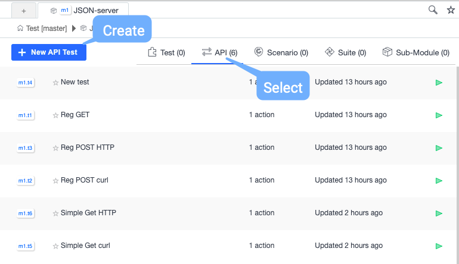

In projects where you use both UI and API tests, we recommend that you follow a shared module structure, where UI and API tests can be found in the same modules. If you decide to create a new API module structure, use a naming prefix, such as API, to keep them apart easily. 

### API action relationships
When creating an API test, an API action will automatically be added to the test. An API test can have several API actions, which will be executed in a sequence, similar to clicks and validations in a UI test.

An API action can also execute several API calls. This means we have an unusually intricate hierarchy, with the following one -> many relationships (denoted -*>). 
```
Test suites -*> API tests -*> API actions -*> API calls
```

This might seem overly complex, but there is a reason for this complexity. Boozang was built to be able to run complex end-to-end API call flows alongside UI actions.

As a single UI action can trigger many API requests, this structure allows us to keep a one-to-one mapping between UI actions and API actions. Another bonus is that API load tests, that are set up on a per-action basis in Boozang, can support complex load scenarios, comprised of many API calls.

## The new API UI

### Creating an API test

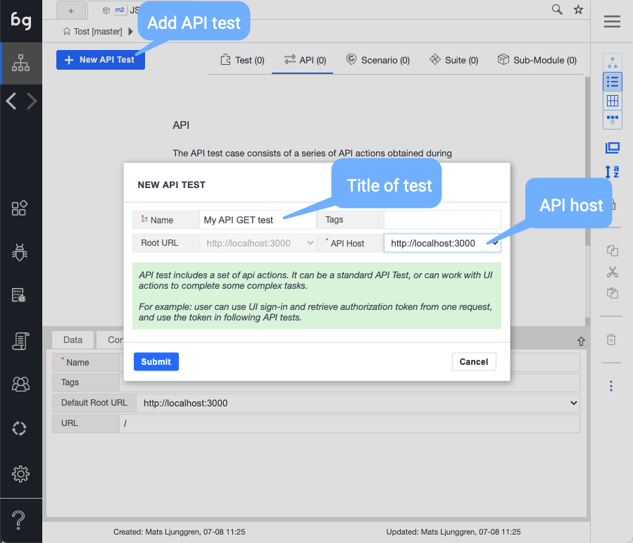

Click “New API test” within the selected module. Besides the name, make sure you select the API host. If the host isn’t shown, make sure it’s set up under Settings-> Environment.

Start by creating an API test from scratch. We will see the following view.

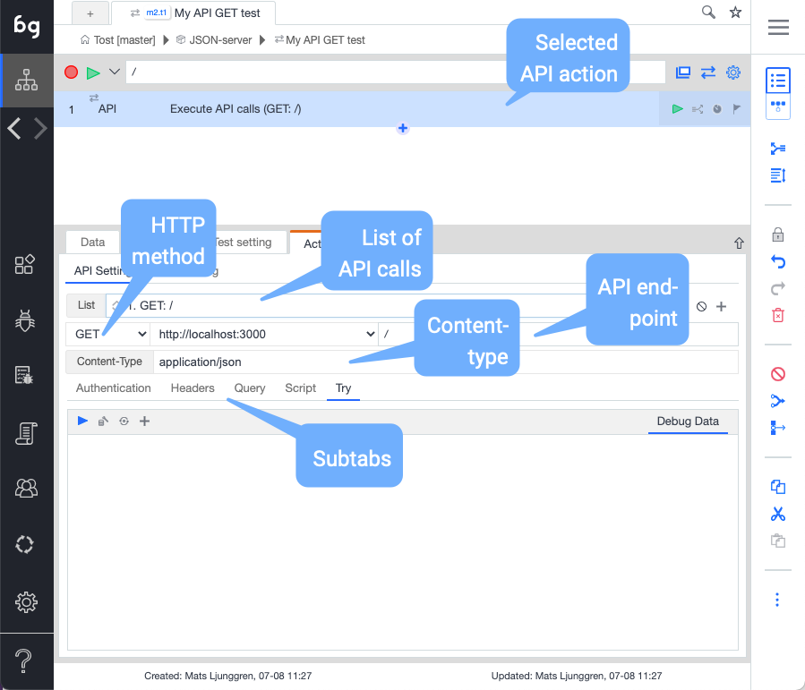


The view is divided into an upper part and a lower part with sub-tabs.

### The API details (upper part)
#### List of API calls

For most API actions, a single API call is enough. There are some cases where is better to group API calls together in a single API action. Let’s imagine the product creation flow, where an API endpoint needs to be called to create the product, then the product id that is returned needs to be used to call a different API endpoint to create a default subproduct.

As both of these API calls are used to create a single product, consider grouping them as two calls in the same “Create product” API action.

#### Add, copy, paste, delete, disable, re-order

All the API calls in the dropdown list can be manipulated with the controls on the right of the dropdown. Notice that you can use the up-down arrows to re-order the API calls.

#### HTTP Method (GET, POST, …) + end-point

Set the HTTP method and the end-point for the API call here.

#### Content-type

Indicates the Content-type in the POST data being sent. Typical content-type headers are “text/plain”, “application/xml”, “text/html”, “application/json”, “image/gif”, and “image/jpeg”.

In Boozang, you typically want to use JSON data (Object data) for REST APIs. In this case, make sure the content-type is set to “application/json”.

### The API details (sub-tabs)
For each API call, you can configure the request details in the sub-tabs

#### Authentication

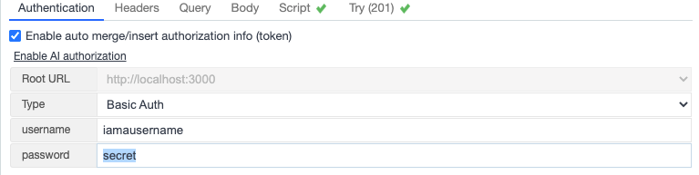

Handles API authentication. As an alternative to setting the authentication headers manually under Headers tab, you can specify the authentication method here. Either pick from one of the suggested policies, or use an auth token directly from the UI interface.

If you choose to use an authorization token from the UI interface, you’ll need to set up the Retrieve token test-case using Boozang AI authorization. This can be setup in Settings -> Environments.

#### Headers

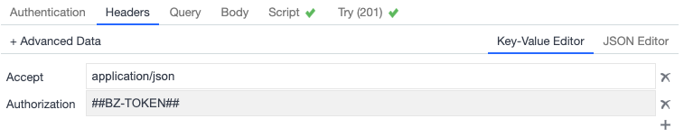

Add request headers using the JSON or key-value editor.

Remember that you can use dynamic data from all data scopes here ($project, $module, $test, $parameter). This is useful to carry over data from a previous API test (or call), or even a UI test.

#### Query

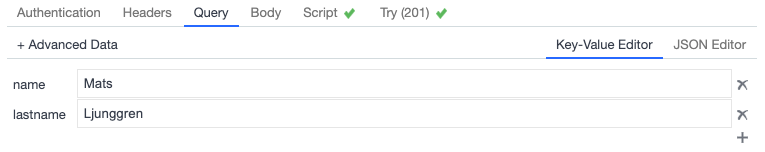

The request URL queries can sometimes be a little messy. Use the query editor to be able to add URL parameters using the JSON or key-value editor.

As mentioned previously, you can use dynamic data from all data scopes here ($project, $module, $test, $parameter).

#### Body (POST only)

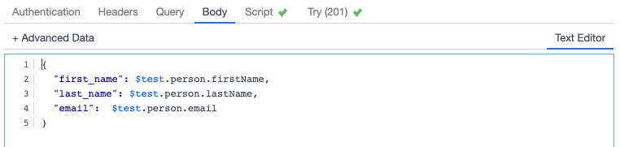

Use the JSON or Key-value editor to set the body content for HTTP POST.

As mentioned previously, you can use dynamic data from all data scopes here ($project, $module, $test, $parameter).

#### Script

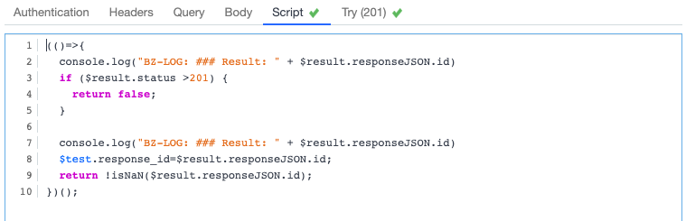

Use the script window to validate the response and assert if the API call is successful or not. Note how returning true means success and false means failure.

The key data structure here is $result. This contains the whole result payload that is being returned. The following things can be accessed from the $result
```
$result.actionResult: Boozang internal containing the execution status
$result.headers: The response headers
$result.idx: Boozang internal id for load tests
$result.request: The request object
$result.responseJSON: The response parsed as JSON
$result.responseText: The response as text
$result.status: The HTTP response code
```
If you want to examine these in detail you can add the following script
```
(()=>{
  console.log("BZ-LOG: ### Result: " + $result.responseJSON.id)
  if ($result.status >201) {
    return false;
  } 
  console.log("BZ-LOG: ### actionResult ", $result.actionResult); 
  console.log("BZ-LOG: ### headers ", $result.headers); 
  console.log("BZ-LOG: ### idx ", $result.idx);
  console.log("BZ-LOG: ### request ", $result.request);
  console.log("BZ-LOG: ### responseText ", $result.responseJSON);
  console.log("BZ-LOG: ### responseText ", $result.responseText);
  console.log("BZ-LOG: ### status ", $result.status);

return true;
})();
```

This way they will show up in the Boozang console window (and the Chrome console).

This script is not limited to only validating HTTP response codes, like in the default script. In below example the script validates that the response id is a number. It also saves the response id in a temporary variable ($test.response_id).
```
(()=>{
  console.log("BZ-LOG: ### Result: " + $result.responseJSON.id)
  if ($result.status >201) {
    return false;
  } 
  
  console.log("BZ-LOG: ### Result: " + $result.responseJSON.id)
  $test.response_id=$result.responseJSON.id;
  return !isNaN($result.responseJSON.id);
})();
```
As mentioned previously, you can use dynamic data from all data scopes here (`$project`, `$module`, `$test`, `$parameter`).

Try

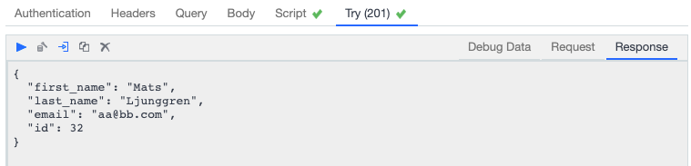

Before running the test, make sure its setup correctly using the this tab. You can try using different data-sets. A green check-mark will show if the request was successful or not. Note how a checkmark appears on the script tab as well. This shows if the script returned true or false, which will be the exit status of the API call.

### Adding an additional API call
You can add an additional API call using the plus (+) icon. As you can see, you can also, copy, paste, delete, and disable API calls in this menu.

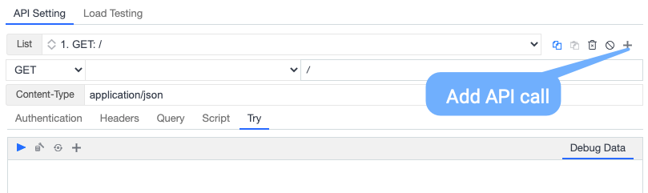

### How to use the API UI
The best way of getting to know the API UI is to test it out on a familiar API. The layout should be familiar enough to Postman users, and to new users, it is recommended they try it out on an API placeholder service such as JSON-server. 

## Importing and exporting API tests
### A note on imports
Boozang now supports importing API calls. As an API call needs an API action, it’s ideal that the user starts by creating an empty API test as a starting point.

Start by adding the API call using the plus button next to the API call drop-down.

### Exporting API call (Postman example)

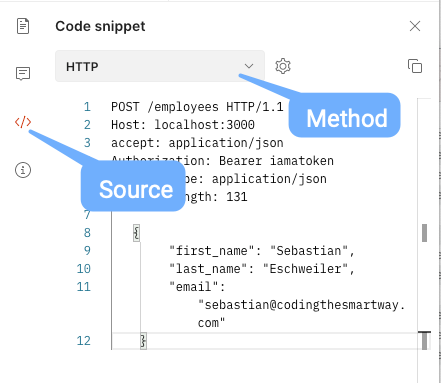

To export the API call from Postman, use the Source code view in the below image.

Note: Boozang currently supports HTTP and cURL format.

### Importing the API call to Boozang

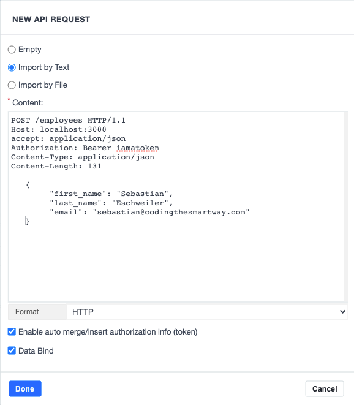

Simple copy-paste the text content from the Postman window to the Boozang window according to the below image. 

Remember to verify that the correct format is selected.

After the import, use the “Try” tab to verify that the API call can be made and that the import was successful. If not, verify that the information in the other tabs is correct.

### Exporting an API call

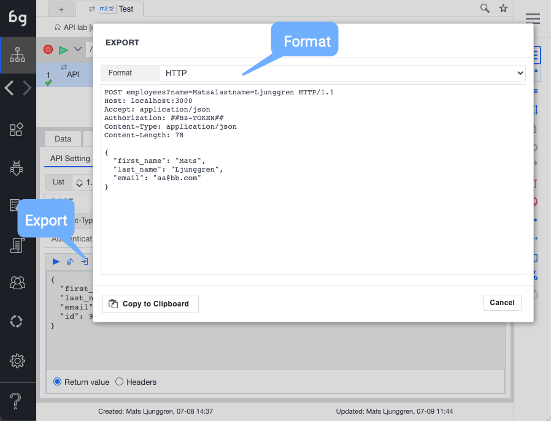

As most tools don’t share the API test hierarchy, we support export of individual API calls rather than whole API tests. Just like in Postman, API calls can be dependent on dynamic data from Boozang variables, and as these variables might not be meaningful outside Boozang, the export needs to be done using real data.

As you can see from the above image, the export therefore happens from within the Try-tab, where the user can pick the values used.

After clicking the “Export” button, the user chooses the export format

- HTTP: Good for imports into other tools, easy to read
- CURL: Good for imports into other tools, troubleshooting

Using the cURL export function is very useful when troubleshooting, as it can be run from command-line. That’s why this should be the format of choice when opening a ticket to a team that doesn’t have access to the Boozang tool.

## Conclusion
There are great tools out there for API testing, like Postman, but it’s limited when you have advanced data dependencies between API calls. If you have dependencies between API and UI tests, you’ll probably need to build your own framework.

Boozang is focused on solving these kind of problems, using a single browser-based solution. As we support BDD / Cucumber and JIRA / XRay integration we enable a unified testing process where Gherkin business language can be used for all tests, regardless if it’s manual, UI tests, or API tests.

By having a unified testing process instead of a siloed approach, tools such as JIRA and XRay can truly be utilized, allowing for improved output from the whole organization, not just the Quality Assurance team.