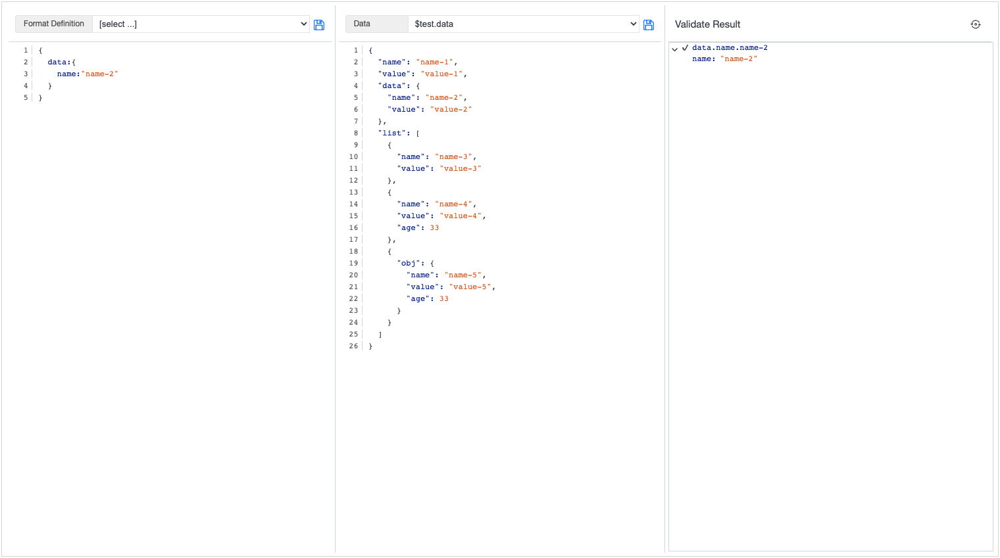

import YouTubeEmbed from "@site/src/components/YouTubeEmbed";

## Utility function
We also support data validation nbased on the JSON-path

```
- $util.validateData(data, JSONPathValidationExpression)
```
This allows you to run validations of JSON payloads, similar to the JSON extract function. The `JSONPathValidationExpression`
supports regular expressions, and a syntax similar to the JSON extract.

## JSON compare editor

To simplify the creation of a suitable `JSONPathValidationExpression`, we have also created a novel editor. This can be accessed 
from the sidebar just under the `Temporary database` icon.

When opened, you can try different expressions on any data. The left view is the `JSONPathValidationExpression` and the center view has the 
data you want to validate. The right view contains the validation result, as shown in the diagram. 



Try experimenting with different data and validation expressions.