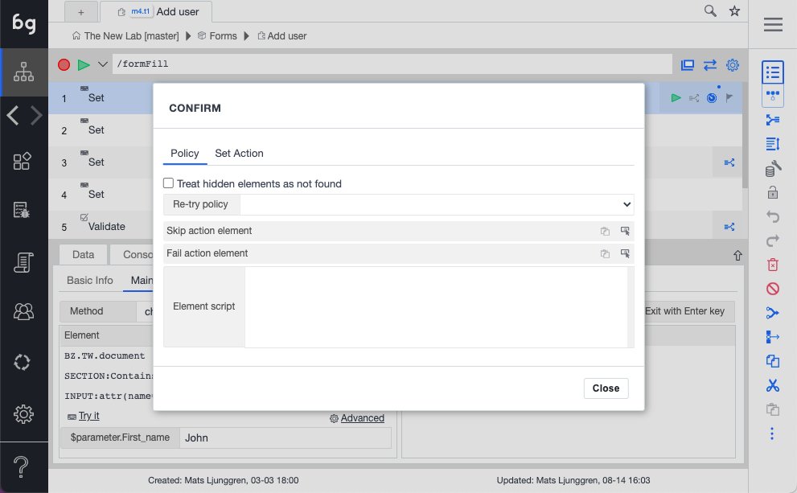

Under the kebab menu, you can also access the element policy. 

- Treat hidden elements as not found: Normally, hidden elements can still be clicked programmatically. Check this box to trigger Error ()"element not found") when an element is hidden. 

- Element re-try policy: The default behavior is to **Re-try on element missing**. Customize this to **Never re-try** or **Re-try on content mismatch** (re-tries when an element is found but the content is wrong).

- Skip action element: Select and element that will trigger skipping to the next action. This can be useful, when having a system that responds slowly, and you have different possible outcomes, like a login confirmation. Instead of waiting a long time for an element to appear, use skip action element to skip directly to next action when an expected element shows.

- Fail element: Same as skip element, except that the action fails when selected element appear. As an example, this can be useful to automatically trigger failures when error messages show. 

- Element script: Use element script for extremely difficult controls, that might need a combination of element events to activate. This is very rarely needed, but works as a last resort. 
