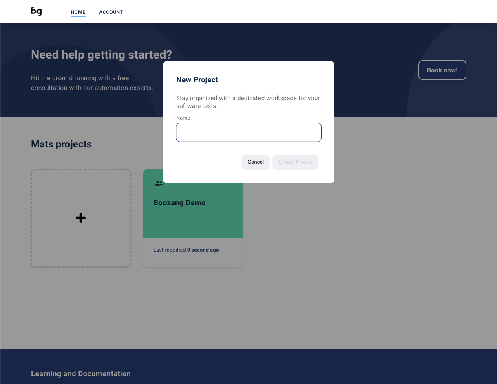
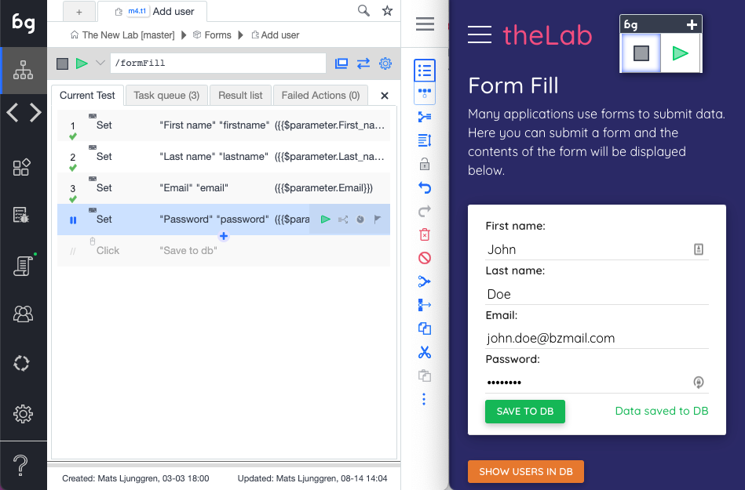
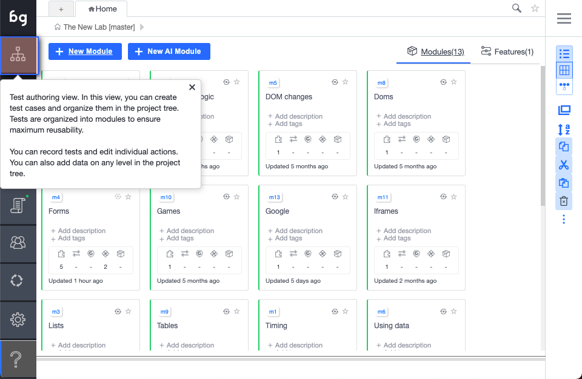

## Signing  up / Logging in

import YouTubeEmbed from "@site/src/components/YouTubeEmbed";

<YouTubeEmbed embedId="RdMmKp5j6Wc">Docusaurus green</YouTubeEmbed>

Short Summary for [Boozang Introduction: Signing up & creating your first test](https://www.youtube.com/watch?v=RdMmKp5j6Wc) by [Merlin](https://merlin.foyer.work/)

"Boozang Introduction: Signing up & Creating Your First Test"

[00:03](https://www.youtube.com/watch?v=RdMmKp5j6Wc&t=3) Signing up & creating first test

[00:37](https://www.youtube.com/watch?v=RdMmKp5j6Wc&t=37) Signing up and creating your first test on Boozang

[01:13](https://www.youtube.com/watch?v=RdMmKp5j6Wc&t=73) Boozang test tool can be launched and test projects can be managed.

[01:51](https://www.youtube.com/watch?v=RdMmKp5j6Wc&t=111) Entering the application URL to create a test project

[02:22](https://www.youtube.com/watch?v=RdMmKp5j6Wc&t=142) Creating a module for testing

[03:00](https://www.youtube.com/watch?v=RdMmKp5j6Wc&t=180) Boozang allows easy test creation and execution

[03:31](https://www.youtube.com/watch?v=RdMmKp5j6Wc&t=211) Easily record and playback tests

[04:08](https://www.youtube.com/watch?v=RdMmKp5j6Wc&t=248) Boozang is module-based for large-scale test automation.

---------------------------------

You can sign-up for Boozang from the Boozang homepage at https://boozang.com. The sign-up link will take you to https://ai.boozang.com. If you are in Europe or Asia, try switching to our European site https://eu.boozang.com. These are the Boozang application servers, which are responsible for communicating with any instances of the Boozang tool, which is running locally on the client-side. 

This is also where an administrator can maintain different teams and different projects, without having to launch anything client-side. 

## Creating a project

As soon as you have signed up, you can go ahead and create your first project in the Cloud dashboard, by clicking the button: "Create Project". There are a lot of options available here, but the only thing required is the project name. 

## Environments

Boozang supports many application interfaces (for example: management, traffic, store) across many different environments (test, QA, staging, production). The purpose of this is to be able to allow a single test to be re-used across different environments without any risk of having to edit the test. If tests are duplicated and individually customized to run on an environment, over time, maintaining these tests gets very expensive, so it´s better to set this up properly from the get-go. 

## Recording a test

Boozang works within the browser which allows for a very stable recording function. Simply click on the record button in the tool. As you perform actions on your web page actions will be recorded. To remove an un-wanted action that was recorded press the trashbin next to the action in the main tool view. 

As soon as a test has been created you can use the playback button to replay the test steps. Boozang supports four different playback modes: **Normal**, **demo**, **remote** and **automation** mode. Demo mode slows down the playback speed and annotates every test step. This is good for demos and when trying to understand a test that someone else has authored. Remote play allows you to dispatch a test run to a remote server. Upon completion of the test, the result will be reported back to you.

A test is automatically saved in the local storage of the browser. If you want to prevent other team members from doing any changes to a test you are working on, click the lock. Other team members will see the test as locked, and will be un-able to do any changes. Any lock can be forcibly opened by any other team member. You will be notified if someone unlocks a test you have locked. 

### A note on Window alignment

To use Boozang well, we recommend aligning the Boozang tool and your application next to each other side by side in the following way

This allows you to get a good overview of the recorded actions, and an easy way to modify or delete recorded actions.

## In-tool help

As Boozang is completely hosted in the Cloud it's easy to do changes and add useful features quickly. This has a huge upside as we can deploy features that customer asks for to all our customers at the same time, to the benefit of all. This also means that new things can appear in the user interface without warning, and in some cases, the documentation might not be up-to-date all the time. 

For this reason, to be able to deliver new features fast without forcing the end-user to re-learn, we added an online help function inside the tool. To activate help, click the question mark in the user interface, and click the functionality and an explanation will appear. 

In the help text, you will find an explanation of the function you selected. You will also find any related videos to that function, if available. When clicking a video link, a separate video window will appear and you will be able to follow along with the tool if needed. 
