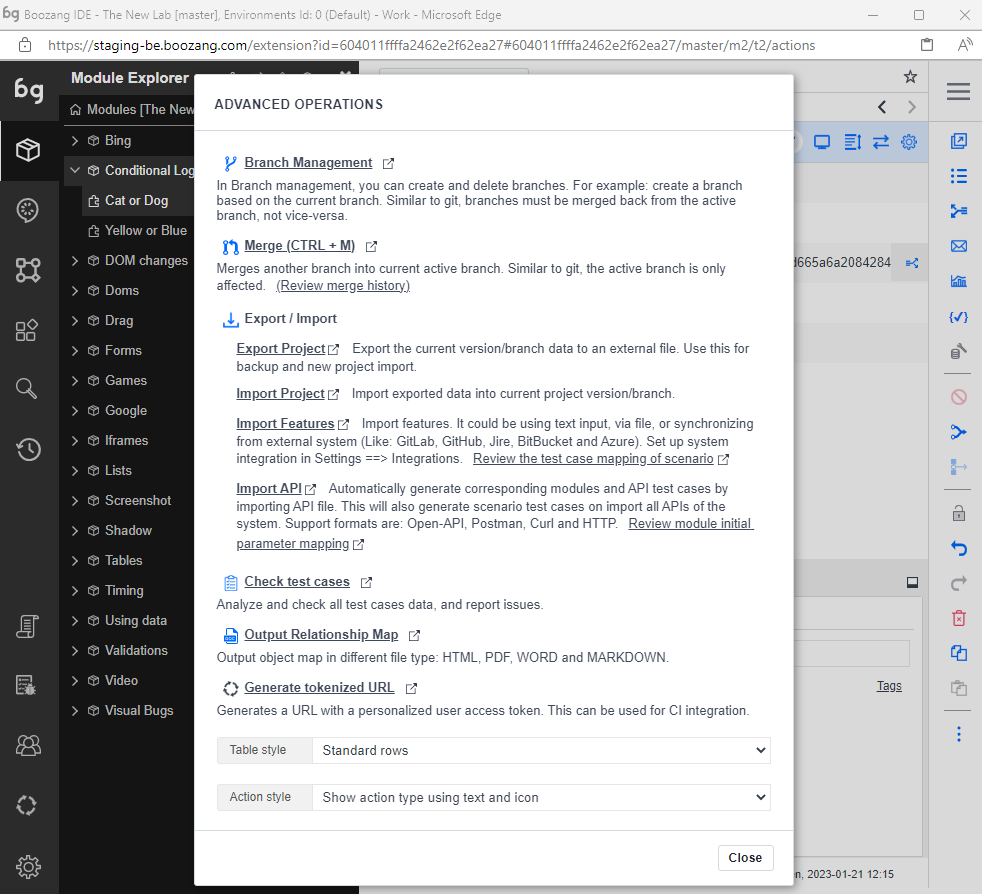
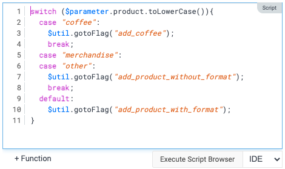
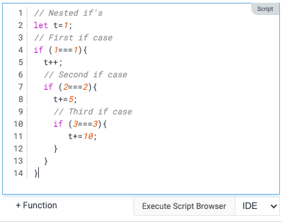
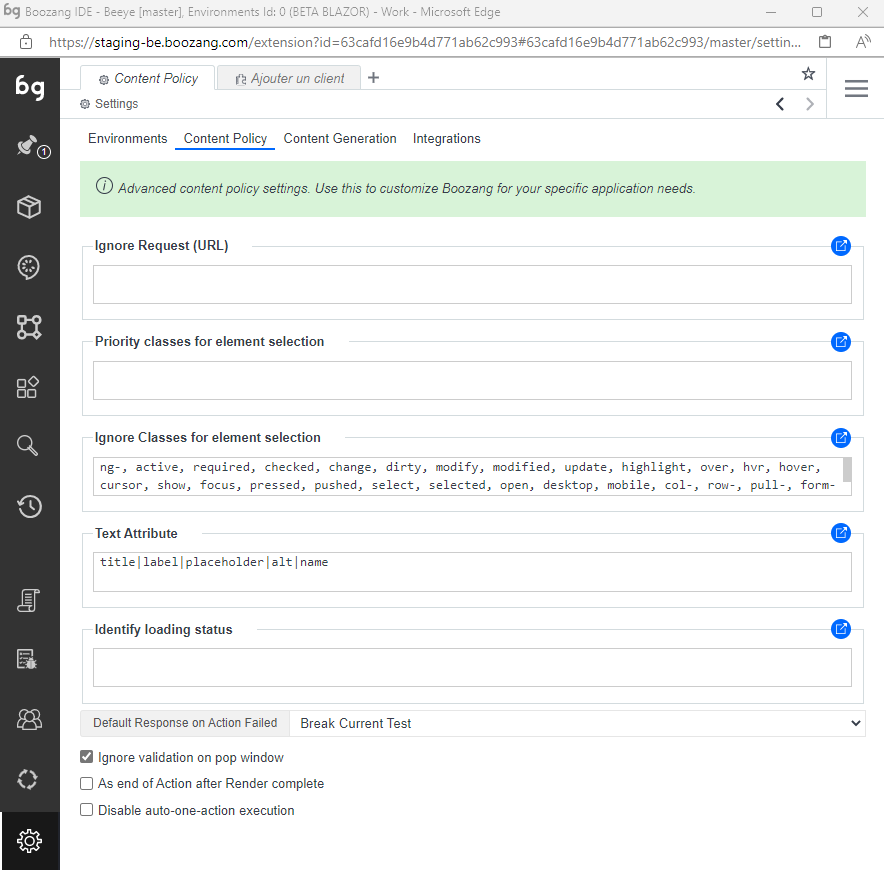
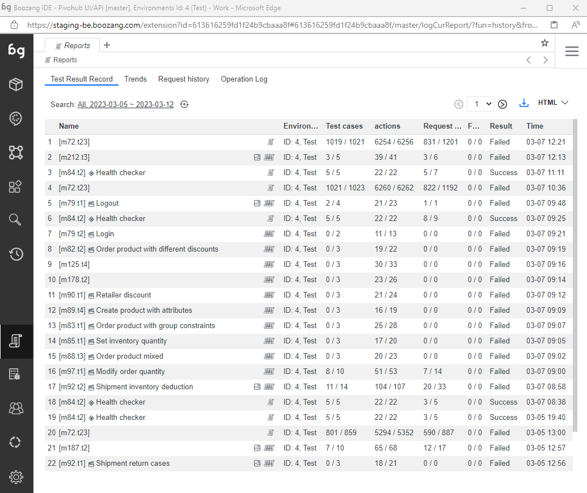
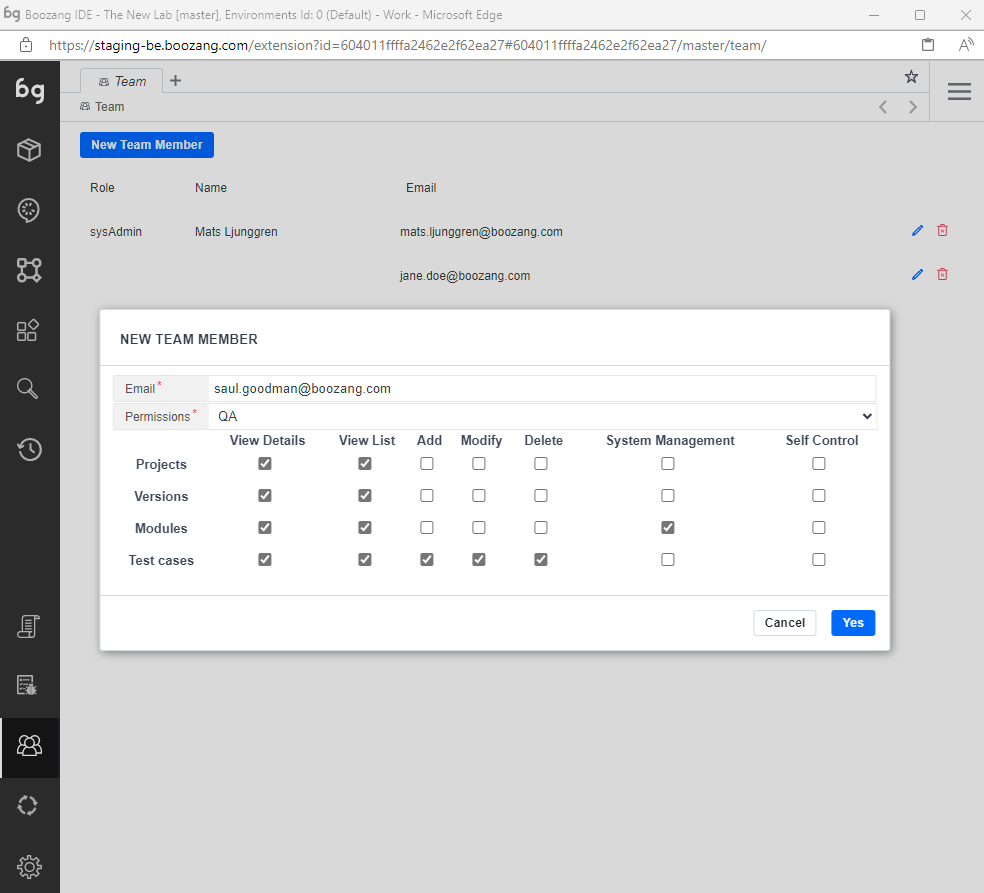

import YouTubeEmbed from "@site/src/components/YouTubeEmbed";


In this section, we explain all the toolbars and controls, basically what does what. You can skip this section and use as a reference when you get stuck or have some questions. 

In Boozang we use a tree navigation similar to desktop IDEs, such as Visual Studio code. 
If you are familair with tools like this, it should be quite easy to get started with Boozang. If not, remember 
that you can either explicitly navigate the test tree, or use the search to quickly find what you are looking for.


One difference in Boozang compared to file-based editors, is that we make a distinction between
- Modules / Tests: Code / test domain
- Features / Scenarios: Cucumber-based business domain
- AI models: Model domain
- Components: Re-usable components

For most users, the Module / Test domain and Features / Scenarios are suffient to cover most testing needs.

## Static vs. dynamic tabs

Similar to Visual Studio code, we support static and dynamic tabs. In the context of tabbed interfaces, "static tabs" and "dynamic tabs" refer to the way that the tabs are generated and displayed.

Static tabs are tabs that are hardcoded into the interface and are always present. These types of tabs are typically used to provide a consistent navigation structure for a user, as they allow the user to access a set of predefined pages or views at any time.

Dynamic tabs, on the other hand, are tabs that are generated and displayed based on the current context or user actions. These types of tabs are often used to allow a user to open and work with multiple documents or pages simultaneously, as they allow the user to open and switch between multiple tabs as needed.

For example, in a text editor like Boozang, static tabs might include tabs for the settings, reporting, and terminal views, while dynamic tabs might include tabs for open documents or files.

## Sticky tabs

A "sticky tab" is a tab that is "pinned" or "fixed" in place and does not close when the user navigates away from it or closes other tabs. This allows the user to keep certain tabs open and easily accessible, even if they are not currently being used.

<YouTubeEmbed embedId="Ey9_9iwaA9c">Static vs. Dynamic tabs</YouTubeEmbed>

Sticky tabs can be useful in a variety of contexts, such as:

Keeping a tab open that provides important information or context (e.g. a dashboard or reference page)
Allowing a user to quickly switch between frequently used tabs (e.g. a list of emails or tasks)
Ensuring that certain tabs are not accidentally closed (e.g. a form that is in the process of being filled out)
To create a sticky tab, the user typically needs to use a specific keyboard shortcut or click on a "pin" icon that is displayed next to the tab. The specific method for creating a sticky tab can vary depending on the application or interface being used.

## Workspace

We also support a concept that we call workspace. This allows me to add a set of tests I'm working on to my workspace, so I can easily 
switch between these tests quick. We have found it's very useful when working on a Cucumber / Gherkin scenario, and the test steps therein.

<YouTubeEmbed embedId="iOkWLOQUnDo">Workspace</YouTubeEmbed>

To add a test to the workspace, simple use the tree menu and click "Add to workspace". A new workspace icon will show up on top of the sidebar. After you are done with the test, you can simply remove it from the workspace using the 


## The sidebar

The sidebar contains the following functions

Top part: 

- Workspace: Initially hidden
- Module explorer
- Feature explorer
- Model explorer
- Component explorer
- Search
- History

Lower part:
- Reports
- Known issues
- Team
- CI
- Issues


<YouTubeEmbed embedId="g5iA8aJu0zE">Docusaurus green</YouTubeEmbed>


## The hamburger menu

In the top right cornert, you can find the hamburger menu. This contains global system functions, that are not necessarily related to testing. 


- Management

Takes the user to the Boozang Cloud Management interface. This allows the user to switch between projects. 

- Account

Access the account page. Here you can see your user settings, and you can also switch language. Currently, English and Chinese are supported in Boozang.

- Post ticket to Boozang

Open a ticket directly to Boozang support from the tool.

- Chat & Message

Opens a popup chat with the team. Here you can monitor project activity and chat with other project members. 

- Video Tutorials

This is a link to the video tutorials on the homepage. 

- Documentation

This is a link to the latest version of this document. 

- Video Helper

This opens a small helper that gives you topic-based video help based on certain topics. 

Note: Some of this video material may have been recorded on top of previous versions of Boozang. 

- Sign Out

Log out the user. 

## The top bar

It's no secret that Boozang has been greatly inspired by the navigation of traditional programming IDEs, especially Visual Studio Code. This means that programmers should be already familiar with the navigation. We are further added test automation controls, such as record and play, as you can see in the image below. 


- New tab

Opens a new tab. The new tab will be navigate you to the root of the project. This allows you to keep a test open, and work on another test simultaneously, by simply switching tabs.  

- Current tab

Boozang supports tabbed navigation similar to a desktop IDE like Visual Studio Code. Helpful when working on several tests at once. 

- Navigation bar

The navigation bar tells you where you are in the project tree, and enables you to quickly navigate it. From the image

- Project: Beeye
- Branch: master
- Module: + Client
- Test: Ajouter un client
- Enviorment: BETA BLAZOR

By clicking any entry or arrow in the navigation bar you can navigate the tree. For instance, to change branch, simply click "master". The navigation is similar to Jenkins, where clicking an entity will navigate you there, while clicking an arrow will allow you to navigate between modules and tests, respectively. 

- Bookmark 

Bookmark tests and modules as you see fit by clicking the star. Simply click the star a second time to remove bookmark. The bookmark menu will show on hover. 

- Search

Search the project for any test, module, or Cucumber test step. Use advanced testing to do more specific searches, like variable names or page elements. 

- Record

Start a recording of a test. If application window is closed, it will open the application window at the given URL. If the URL is simply set to "/", it will open the application at the URL set in environment settings. Try using relative URLs as much as possible, so the hotname set in environment setting is used. 

- Play

Plays the test from the URL given.

- Application URL

The URL for the test. Boozang supports both absolute and relative URLs. Try using relative URLs as much as possible, so you can make use of the hostname set in Settings -> Enviroment. That way, you can easily can tests that can run of different environments (such as staging or production).  

- Open Window

Opens the application window at the current URL.

- Requests

Registers all requests to the back-end, such as Restful API calls. Click to open API "snoop" menu, that allows you to record API tests by doing UI interactions. 

- Test Settings

Set specific settings for the test execution. The default settings is usually ok, so this is normally not necessary. 

## The right bar


- Switch view: Table / GUI: The switch view button toggles between table and diagram view. The table view should be used when authoring tests, and is the view you will use a majority of the time. The GUI will is useful to understand how the test intercats with other tests. 

- Navigate to parent: Navigate up the testing tree. 

- Expand action rows: Expand the action rows to show more test information. The expanded view is useful to troubleshoot passing of parameters and customized exit conditions. 

- Lock: Lock the test case to prevent other team member from modifying the test. As tests are auto-saved in Boozang and all other team members recieve these updates automatically, all tests are unlocked by default. 

- Undo / Redo: Undo or Redo latest modification. 

- Delete: Deletes one or several actions.  You can also use the "Delete" key. 

- Disable: A disabled action is skipped when a test is run. Useful to debug tests. 

- Group: The group function group's actions together. This allows you do keep your test in order, and to skip a set of actions using the exit condition Exit Group. By using Else-group, this can be used to implement simple conditional functionality (compare: if / else)

- Generate test case: Breaks up a group of actions into a separate test and replaces the group with a reference to that test (Plug-test case). It allows you to quickly refactor your tests to remove duplicate action sequences.

- Cut / Copy /Paste: Standard Cut functionality. Use Cut and Paste to move actions between tests, tests between modules, or data between tests and modules.

*Tip: Use Ctrl/CMD functions to multi-select.*

### Kebab menu (...)

This menu opens an advanced menu with the following options

- Branch management: Boozang has an built-in version handling, similar to Git. Create new branches and delete existing ones
- Merge: Merge branches. If there is a conflict, a visual interface will allow you to cherry-pick chnages from the two branches. 
- Export / import: Export and import full Boozang projects, import features (from most Version-control systems or Jira / Xray), or Import Open API specifications. 
- Check test cases: Automatically checks you test cases for common problems. 
- Output relationship map: Output test relationships in a map. Export formats supported are: html, pdf, and markdown.
- Generate tokenized URL: Generate a unique test URL for current tests that can be run by a CI server.




## The action list

As you record or manually ass actions to a test, these show up in the action list.


### Event

An icon, word, or both that indicates the action type. The different action types are **Set**, **Validate Result**, **Mouse Event**, **Keyboard Event**, **Extract data**, **Javascript**, **Comment**, **Refresh Window**, **Plug Test**, and **Visit Links**.  

*Tip: Clicking the action icon toggles breakpoints. Test execution is temporarily stopped at breakpoints, allowing for troubleshooting of tests. To resume playing the test, click the play button.*

### Action description

This is the human-readable description of the action and defaults to the actual action code. If needed, this can be changed on the auction details page.

### Value

The value used for applicable events (Set, Validate). Orange indicates that dynamic data is used. The following data scopes are available: $parameter, $test, $module, $project, $loop


## Add action in list

Inserts a new action in the action list manually. As events are often recorded, most other action types will be added in manually. The actions can be added during an active recording section, or when the recording has stopped. 

## Run action

Double-click on an action to execute a single action. 

## Custom timeout

Indicate that the timeouts for that particular action have been customized. This can be done by editing timeouts in action details. In the case of slow response times during recording, this will also be added automatically to ensure test stability. 

## Custom exit conditions

Indicate that exit conditions for the action have been customized. Exit conditions signify what action is taken on a certain action outcome. Action outcomes are Success, Fail, and Error. Success means the action was executed successfully, Fail means that it executed falsely, such as validation fail, and Error means element not found. 


## Recording

To record a test, click on the record button. Boozang will now catch any action being made in the application window. To stop recording, click stop. In the case where the application window is closed, the record will open the application window at the current URL. Use the Reload URL button to make sure that the URL is set correctly before recording.

## Playing a test

To play a test, click the Play button. To play the test from the start; make sure that the first row (gray) row of the action list has been selected as this signifies the actual test. You can also play a test from a specific action. Simply select the action you want to play from and click the Play button. You can choose to watch all the actions play and see the result in real-time, or switch to the report view to see the report being generated. 

There are several play modes available

- Play test case: Plays to end. Launches AI repair if element not found, but continues after a set time. 

- Remote play: Plays the test, but tries to repair it when the element is not found.

- Play upstream test: Plays the top parent test case. In case there are many of them, you will be prompted to select the test to run. 

- Step forward: Plays the test one step at a time.

- Play in demo mode: Plays the test case step-by-step and highlights all actions in the application window using annotations (compare comment function).

- Generate action screenshot: Plays the test and generates screenshots for all steps. 

- Automation mode: Emulates running the test from the command line using the Boozang test runner. After a test has been run, a dialog will show allowing the user to opt-out of the browser shut down. Running in this mode will notify all report subscribers, so it´s a good way to test email notifications.  

Running in automation mode never activates AI repair, which will prompt the user to re-select elements when they are not found in the application window. 


## Adapting the screen size

In Boozang we do not support testing of native mobile application, but we provide a number of functions to do mobile we testing. 

One of these functions is the ability of setting the size of the application window, which can be done next to the URL bar of the test.

<YouTubeEmbed embedId="QXFt52AvwUs">Adapting the screen size</YouTubeEmbed>

## Undo / Redo

We alos support a powerful Undo / Redo functionality. The Undo history is saved server-side which allow for better persistency
of history and ability to even undo changes done by a different team member.

<YouTubeEmbed embedId="WwnujKLPah0">Undo / Redo</YouTubeEmbed>

## Coding tests in Boozang

Boozang also supports coded tests. We recommend recording a basic test and switching to the code view to get an idea of the test syntax. 

<YouTubeEmbed embedId="YnAPWQPtP3Y">Adapting the screen size</YouTubeEmbed>

We are super excited to introduce an enhanced code editor. This means it will be easier to find mistakes in Javascript, and easier to troubleshoot problems.

## Syntax highlighting

Syntax highlighting is a feature commonly found in programming editors that helps make code more readable and easier to understand. It does this by applying different colors and styles to different parts of the code, based on their function or syntax.

Here are some of the benefits of syntax highlighting in programming editors:

- Improved readability: Syntax highlighting helps to make code more readable by visually separating different elements of the code, such as keywords, variables, comments, and strings.

- Easy error identification: Syntax highlighting can help identify syntax errors or mistakes in the code by highlighting them in a different color or style, making them easier to spot and correct.

- Faster coding: By highlighting different parts of the code, syntax highlighting can make it easier for developers to write code quickly and accurately, especially when dealing with large code files.

- Improved learning: Syntax highlighting can help beginners learn programming by providing visual cues that make it easier to understand the structure and syntax of the code.

Overall, syntax highlighting is a useful tool that can help make programming more efficient, effective, and enjoyable for developers of all levels.




We have introduced syntax highlighting. The following colors are used

- Purple: Javascript reserved words
- Blue: Scope handles ($project, $module, …)
- Orange: Strings
- Red: Regular expressions
- Gray: Comments

## Indentation

Code indentation is the practice of adding whitespace (such as spaces or tabs) at the beginning of lines of code to visually group related code together and make the code easier to read and understand. Here are some reasons why code indentation is useful:

- Improved readability: By using indentation, code becomes easier to read and follow, as related blocks of code are grouped together and separated from unrelated code. This can make it easier for developers to understand the flow of the code and identify errors.

- Better organization: Indentation helps to organize code by clearly showing the hierarchy and nesting of code blocks, making it easier to identify where functions and loops start and end, and what code is part of a particular block.

- Easier debugging: Indentation can also make it easier to debug code by visually identifying where the error may be located. It can help developers identify which block of code may be causing the problem and make it easier to trace the execution of the code.

- Consistency: Indentation helps to enforce consistency in code formatting, making it easier for multiple developers to collaborate on the same codebase. It can also help to ensure that code conforms to certain style guides or conventions.

Overall, code indentation is an important practice that can make code more readable, organized, and easier to debug, which can ultimately lead to better code quality and more efficient development.



## Redo / Undo

We have also introduced Undo / Redo into the editor.

- Redo: Ctrl + y 
- Undo: Ctrl + z 

Note: A series of changes in the editor is saved as a single action. That means that when using the action Undo / Redo, the editor history is cleared.

The purpose of undo/redo functions in coding is to provide an easy way to undo or redo changes made to code. This can be helpful in a variety of situations, including:

- Error correction: When working with code, it's common to make mistakes or accidentally delete code. The undo function provides an easy way to revert back to a previous version of the code and correct any mistakes that were made.

- Experimentation: Sometimes, when writing code, you might want to try out different approaches or test different solutions to a problem. The undo function allows you to easily undo changes and try out different solutions without having to worry about losing work.

- Efficiency: The undo function can also help improve coding efficiency by allowing developers to quickly revert changes or try out different approaches without having to manually recreate code.


## Key shortcuts

We also introduced the most common shortcuts. Here is a list of supported shortcuts

- Select all: Ctrl-A
- Go to end of line: End-key
- Go to end of document: Ctrl-End-key
- Go to beginning of line: Home-key
- Go to beginning of doc: Ctrl-Home
- Increase comment out section: Crtl-/
- Decrease comment out section: Shift-Crtl-/
- Delete right word: Ctrl+delete
- Delete left word: Ctrl+backspace 
- Move cursor by word: Ctrl+left 
- Move cursor by word: Ctrl+right
- Add indentation in multiple-lines: Select lines + Tab
- Remove indentation in multiple-lines: Select lines + Shift-tab 


## Environments

In the Environment tab, you can find several useful functionalities. You can manage environments and different application interfaces, configure settings on an application interface level and also setup AI login/logout for different roles/users.


There has been some confusion around environment and application interfaces, so it's important to make sure you get this right as it will save you potential work in the future. Environments signify an environment, such as *development*, *staging*, *QA* or *production*. By specifying different entry URLs for these environments, test become completely re-usable. This means there is no need to maintain different tests or projects across different environments. Simply change the environment setting and re-run the same test.

The application interface setting handles when there are different applications within the same environment. For instance, in the E-commerce case, there might be a *storefront* and a *managememt* interface. When creating a test, pick the interface that the test is for. If this changes during the project, it has to be changed in one place, not across several tests.

- Advanced / Configure: This setting allows you to configure certain things on an Environment / App interface level. These settings will typically be things that could vary across environments, such as delays and other performance-related settings. 

- AI login / logout (Authorization Setting): This allows the user to define several user roles and automatically generate the login and logout scenarios for these roles. The user roles can be set as pre-requisites for tests, automatically switching between users. For more information, read more under the **Model-based testing** chapter. 

## Content Policy

The content policy contains several advanced features. Nevertheless, spending some time here to fine-tune the project can increase the stability of tests and also speed up test creation significantly.



### Ignore Request URLs

A list of hosts or URLs that should be ignored by Boozang.

 This means the platform will not wait for any responses from these hosts,
or report any problems related to them in report -> Extra info.

It’s useful to add, for instance, hostname for analytics tools,
to speed up execution and improve stability. 

### Priority classes for element selection

List of classes that should be prioritized when selecting elements. 

Wildcard character (*) is supported.

### Ignore classes for element selection

List of classes that should be ignored in the element selection. The default classes that are ignored by Boozang is

```
ng-, active, required, checked, change, dirty, modify, modified, update, highlight, over, hvr, hover, cursor, show, focus, pressed, pushed, select, selected, open, desktop, mobile, col-, row-, pull-, form-control
```

Wildcard character (*) is supported.

### Text Attribute

Attributes used for text representation, used in a similar fashion to title. 


### Identify loading status

Identify that the page is still loading using element CSS or scripts. 

If a loading element is matched, Boozang will automatically wait for it to disappear.

Ideal to set if the application has a loading spinner.

### Ignore validation on pop window

When checked, any pop windows (alerts, prompts, confirm pop-up dialogs) will not be verified by Boozang. When un-checked, Boozang will add an assertion during recording based on pop windows that appeared. On playing back the tests, Boozang will make sure that the same pop windows appear as during the recording and fail the test otherwise. 

## Reports



The main report view contains the report from the test that was run in the browser last. The report view reflects only local runs of the test and is not in any way a consolidated view of reports (this consolidation can be done in a data warehouse or CI server). 

- The view link: To find tests quickly, click the View link to go to the test. This is especially helpful when the testing report has been sent via email. 

- The diff link: If an assertion fails that has content, such as Validate -> innerText, you can use the diff link to see the difference in content between the reference and resulted response. For dynamic data, hover over the name to see the values that were used. 

- Performance warnings: To highlight slow actions or tests, this can be done under Environment -> Advanced -> Performance Reminder. Here you can adjust settings that can trigger slow tests to trigger warnings or even fail tests. 

## Team

Boozang also supports team collaboration. As it's completely Cloud-based, all projects are built for collaboration.  

Cloud-based applications offer several benefits for collaboration, which include:

- Real-time collaboration: Cloud-based applications allow users to collaborate on projects in real-time from different locations, as long as they have internet access. This enables team members to work together on a project simultaneously and see changes made by others in real-time.

- Accessibility: With cloud-based applications, team members can access the same files and resources from anywhere and at any time, as long as they have internet access. This makes it easier for remote team members to collaborate with others, and ensures that everyone is working on the same version of the project.

- Version control: Allows users to see the changes made to a file over time, and revert to a previous version if necessary. This is helpful for collaboration as it ensures that changes made by different team members are tracked and documented.

- Reduced reliance on email: Cloud-based applications provide a centralized platform for collaboration, which can reduce the need for email communication. This can help streamline communication and ensure that team members are working with the most up-to-date information.

- Enhanced security: Cloud-based applications typically offer enhanced security measures, such as data encryption and multi-factor authentication, which can help protect sensitive information and prevent unauthorized access.

Overall, cloud-based applications offer many benefits for collaboration, making it easier for teams to work together effectively and efficiently, regardless of their location.



- Adding team members: It's quite straightforward to add a team member to the project. Any team members email you add will receive an email notification with instructions on how to join the project.

- Access policy: Not all users are created the same. To learn about the details of the access policy check out the management interface at https://ai.boozang.com and check the project details. Here you can get a breakdown of the detailed access policy and also customize a role.

- The CI user: Sometimes it's useful to create a CI user with only execute privileges. This way, anyone with access to the CI server will be limited to only run tests, not edit tests or invite other team members.

Tip: It's highly recommended to create a CI user with limited privileges and use the CI user token to run tests from any CI server. This will minimize any potential security problems or web socket conflicts. 

- Chat: There is also project collaboration built-in. Use this to communicate with team members and see test updates as they happen in the project.
