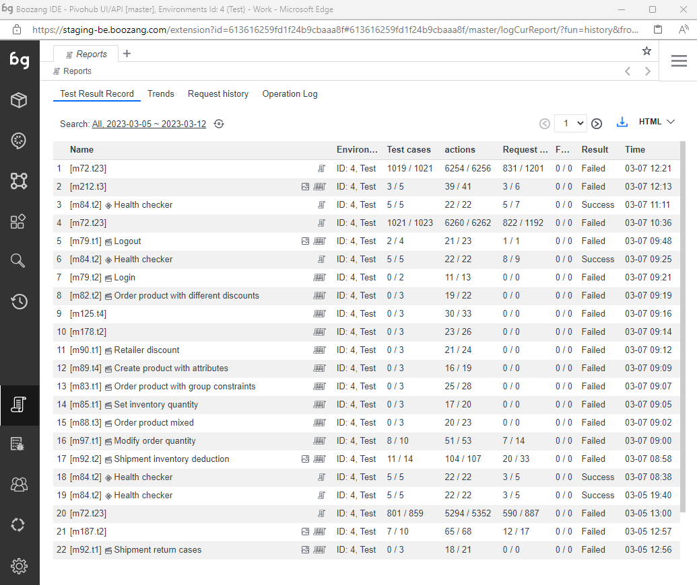
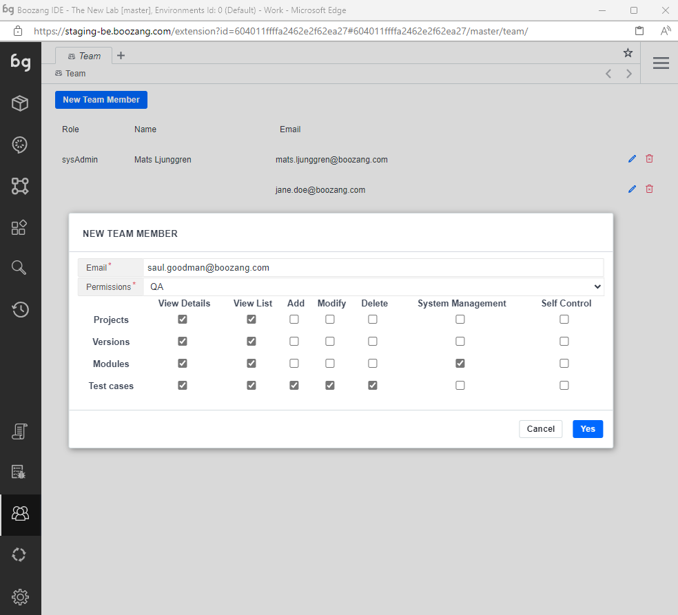

## Reports

<!--  -->

- The report view

The main report view contains the report from the test that was run in the browser last. The report view reflects only local runs of the test and is not in any way a consolidated view of reports (this consolidation can be done in a data warehouse or CI server). 

- The view link

To find tests quickly, click the View link to go to the test. This is especially helpful when the testing report has been sent via email. 

- The diff link

If an assertion fails that has content, such as Validate -> innerText, you can use the diff link to see the difference in content between the reference and resulted response. For dynamic data, hover over the name to see the values that were used. 

- Performance warnings

To highlight slow actions or tests, this can be done under Environment -> Advanced -> Performance Reminder. Here you can adjust settings that can trigger slow tests to trigger warnings or even fail tests. 

<!--  -->

## Team

- Adding team members

It's quite straightforward to add a team member to the project. Any team members email you add will receive an email notification with instructions on how to join the project.

- Access policy

Not all users are created the same. To learn about the details of the access policy check out the management interface at https://ai.boozang.com and check the project details. Here you can get a breakdown of the detailed access policy and also customize a role.

- The CI user

Sometimes it's useful to create a CI user with only execute privileges. This way, anyone with access to the CI server will be limited to only run tests, not edit tests or invite other team members.

Tip: It's highly recommended to create a CI user with limited privileges and use the CI user token to run tests from any CI server. This will minimize any potential security problems or web socket conflicts. 

- Chat

There is also project collaboration built-in. Use this to communicate with team members and see test updates as they happen in the project.

*Tip: This will also be used to link to Slack updates (Roadmap).* 