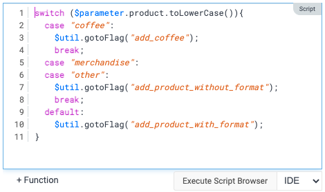
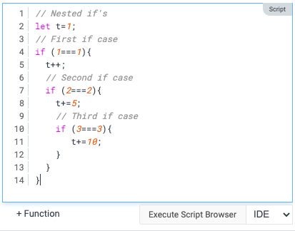

We are super excited to introduce an enhanced code editor. This means it will be easier to find mistakes in Javascript, and easier to troubleshoot problems.

## Syntax highlighting

We have introduced syntax highlighting. The following colors are used

- Purple: Javascript reserved words
- Blue: Scope handles ($project, $module, …)
- Orange: Strings
- Red: Regular expressions
- Gray: Comments

## Indentation

We also support automated indentation.

## Redo / Undo

We have also introduced Undo / Redo into the editor.

- Redo: Ctrl + y 
- Undo: Ctrl + z 

Note: A series of changes in the editor is saved as a single action. That means that when using the action Undo / Redo, the editor history is cleared.

## Key shortcuts

We also introduced the most common shortcuts. Here is a list of supported shortcuts

- Select all: Ctrl-A
- Go to end of line: End-key
- Go to end of document: Ctrl-End-key
- Go to beginning of line: Home-key
- Go to beginning of doc: Ctrl-Home
- Increase comment out section: Crtl-/
- Decrease comment out section: Shift-Crtl-/
- Delete right word: Ctrl+delete
- Delete left word: Ctrl+backspace 
- Move cursor by word: Ctrl+left 
- Move cursor by word: Ctrl+right
- Add indentation in multiple-lines: Select lines + Tab
- Remove indentation in multiple-lines: Select lines + Shift-tab 

Note: On Mac some of these commands need to use the Meta key instead of Ctrl-key.