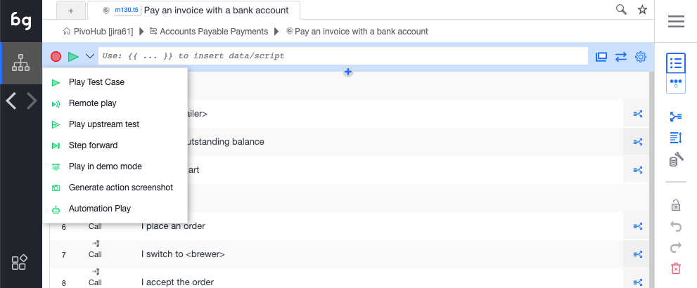

## Recording

To record a test, click on the record button. Boozang will now catch any action being made in the application window. To stop recording, click stop. In the case where the application window is closed, the record will open the application window at the current URL. Use the Reload URL button to make sure that the URL is set correctly before recording.

## Playing a test

To play a test, click the Play button. To play the test from the start; make sure that the first row (gray) row of the action list has been selected as this signifies the actual test. You can also play a test from a specific action. Simply select the action you want to play from and click the Play button. You can choose to watch all the actions play and see the result in real-time, or switch to the report view to see the report being generated. 

There are several play modes available

- Play test case

  Plays to end. Launches AI repair if element not found, but continues after a set time. 

- Remote play

  Plays the test, but tries to repair it when the element is not found.

- Play upstream test

  Plays the top parent test case. In case there are many of them, you will be prompted to select the test to run. 

- Step forward

  Plays the test one step at a time.

- Play in demo mode

  Plays the test case step-by-step and highlights all actions in the application window using annotations (compare comment function).

- Generate action screenshot

  Plays the test and generates screenshots for all steps. 

- Automation mode

  Emulates running the test from the command line using the Boozang test runner. After a test has been run, a dialog will show allowing the user to opt-out of the browser shut down. Running in this mode will notify all report subscribers, so it´s a good way to test email notifications.  

  Running in automation mode never activates AI repair. 

## Adapting the screen size

In Boozang we do not support testing of native mobile application, but we provide a number of functions to do mobile we testing. 

One of these functions is the ability of setting the size of the application window, which can be done next to the URL bar of the test.

import YouTubeEmbed from "@site/src/components/YouTubeEmbed";

<YouTubeEmbed embedId="QXFt52AvwUs">Adapting the screen size</YouTubeEmbed>

[00:01](https://www.youtube.com/watch?v=QXFt52AvwUs&t=1) Boozang Feature: Adaptive screen sizes resolves alignment issues

[00:17](https://www.youtube.com/watch?v=QXFt52AvwUs&t=17) Boozang allows easy specification of application window size

[00:30](https://www.youtube.com/watch?v=QXFt52AvwUs&t=30) Adapt application window and set screen size

[00:45](https://www.youtube.com/watch?v=QXFt52AvwUs&t=45) Boozang allows testing on various screen sizes.

[00:57](https://www.youtube.com/watch?v=QXFt52AvwUs&t=57) Boozang feature allows for adaptive screen sizes.

[01:11](https://www.youtube.com/watch?v=QXFt52AvwUs&t=71) Boozang's Adaptive screen sizes improve experimentation with different screen sizes.

[01:26](https://www.youtube.com/watch?v=QXFt52AvwUs&t=86) Improving adaptability for different screen sizes

[01:34](https://www.youtube.com/watch?v=QXFt52AvwUs&t=94) Improved functionality for simple quick tests on different screen sizes.

------------------

## Undo / Redo

We also support a powerful Undo / Redo functionality. The Undo history is saved server-side which allow for better persistency
of history and ability to even undo changes done by a different team member.

<YouTubeEmbed embedId="WwnujKLPah0?si=T6XXLiKhXbMsHLYm">Undo / Redo</YouTubeEmbed>

[00:02](https://www.youtube.com/watch?v=WwnujKLPah0&t=2) Boozang updated Undo/Redo functionality to save revisions server-side

[00:23](https://www.youtube.com/watch?v=WwnujKLPah0&t=23) Boozang allows for undo/redo and test revision history

[00:44](https://www.youtube.com/watch?v=WwnujKLPah0&t=44) The storage is server-side with the ability to see all updates.

[01:04](https://www.youtube.com/watch?v=WwnujKLPah0&t=64) Boozang allows for easy undo and redo actions.

[01:22](https://www.youtube.com/watch?v=WwnujKLPah0&t=82) Boozang allows for undo/redo and test revisions

[01:48](https://www.youtube.com/watch?v=WwnujKLPah0&t=108) Boozang Feature: Undo / Redo and Test revisions provide branching options

[02:08](https://www.youtube.com/watch?v=WwnujKLPah0&t=128) Boozang Feature: Undo / Redo and Test revisions

[02:25](https://www.youtube.com/watch?v=WwnujKLPah0&t=145) Undo/Redo feature aids in test revisions

---------------------

## Coding tests in Boozang

Boozang also supports coded tests. We recommend recording a basic test and switching to the code view to get an idea of the test syntax. 

<YouTubeEmbed embedId="YnAPWQPtP3Y">Coding tests in Boozang</YouTubeEmbed>

[00:02](https://www.youtube.com/watch?v=YnAPWQPtP3Y&t=2) Introduction to Coded Tests in Boozang

[00:18](https://www.youtube.com/watch?v=YnAPWQPtP3Y&t=18) Boozang allows simple and efficient coded tests.

[00:39](https://www.youtube.com/watch?v=YnAPWQPtP3Y&t=39) Boozang allows users to choose between working in code or using the recorder

[00:55](https://www.youtube.com/watch?v=YnAPWQPtP3Y&t=55) Creating and editing tests with Boozang

[01:09](https://www.youtube.com/watch?v=YnAPWQPtP3Y&t=69) Boozang feature: Coded tests allow exploration of tool functionality through scripting.

[01:24](https://www.youtube.com/watch?v=YnAPWQPtP3Y&t=84) Creating and copying tests in Boozang

[01:49](https://www.youtube.com/watch?v=YnAPWQPtP3Y&t=109) Boozang allows for easy test modification and updating.

[02:07](https://www.youtube.com/watch?v=YnAPWQPtP3Y&t=127) Boozang introduces a new feature for recording test actions.

-------------------------
