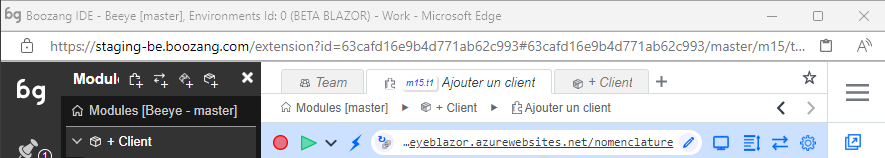

## The sidebar overview

The sidebar contains the following functions

Top part: 

- Workspace: Initially hidden
- Module explorer
- Feature explorer
- Model explorer
- Component explorer
- Search
- History

Lower part:
- Reports
- Known issues
- Team
- CI
- Issues

import YouTubeEmbed from "@site/src/components/YouTubeEmbed";

<YouTubeEmbed embedId="g5iA8aJu0zE">Docusaurus green</YouTubeEmbed>

[00:01](https://www.youtube.com/watch?v=g5iA8aJu0zE&t=1) Boozang sidebar gives access to project tree and test creation mode

[00:32](https://www.youtube.com/watch?v=g5iA8aJu0zE&t=32) The sidebar adds navigation icons and advanced features

[01:04](https://www.youtube.com/watch?v=g5iA8aJu0zE&t=64) Boozang platform allows creating and using components for automation.

[01:43](https://www.youtube.com/watch?v=g5iA8aJu0zE&t=103) Boozang helps to identify root causes of test failures

[02:15](https://www.youtube.com/watch?v=g5iA8aJu0zE&t=135) Boozang provides detailed test reports and team collaboration features.

[02:48](https://www.youtube.com/watch?v=g5iA8aJu0zE&t=168) Boozang provides visibility into parallel workers and easy integration with CI servers.

[03:18](https://www.youtube.com/watch?v=g5iA8aJu0zE&t=198) Boozang allows easy test creation and environment switching.

[03:53](https://www.youtube.com/watch?v=g5iA8aJu0zE&t=233) Boozang sidebar allows integrations and question mark function for help

-----------------

## The hamburger menu

- Management

Takes the user to the Boozang Cloud Management interface. This allows the user to switch between projects. 

- Account

Access the account page. Here you can see current service usage and your current license tier. 

- Post ticket to Boozang

Open a ticket directly to Boozang support from the tool.

- Chat & Message

Opens a popup chat with the team. Here you can monitor project activity and chat with other project members. 

- Video Tutorials

This is a link to the video tutorials on the homepage. 

- Documentation

This is a link to the latest version of this document. 

- Video Helper

This opens a small helper that gives you topic-based video help based on certain topics. 

Note: Some of this video material may have been recorded on top of previous versions of Boozang. 

- Sign Out

Log out the user. 

## The top bar

- New tab

Open a new tab. 

- Current tab

Boozang supports tabbed navigation similar to a desktop IDE like VS Code. Helpful when working on several tests at once. 

- Navigation bar

The navigation bar tells you where you are in the project tree, and enables you to quickly navigate it. From the image

- Project: The New Lab
- Branch: master
- Module: Forms
- Test: New test

By clicking any entry or arrow in the navigation bar you can navigate the tree. For instance, to change branch, simply click "master". The navigation is similar to Jenkins, where clicking an entity will navigate you there, while clicking an arrow will allow you to navigate between modules and tests, respectively. 

- Bookmark 

Bookmark tests and modules as you see fit by clicking the star. Simply click the star a second time to remove bookmark. The bookmark menu will show on hover. 

- Search

Search the project for any test, module, or Cucumber test step. Use advanced testing to do more specific searches, like variable names or page elements. 

- Record

Start a recording of a test. If application window is closed, it will open at the give URL.

- Play

Plays the test from the URL given.

- Application URL

The URL for the test. If you want the test execution to be based on the current application window state, make sure to set the test reload policy to "Never reload". 

- Open Window

Opens the application window at the current URL.

- Requests

Registers all requests to the back-end, such as Restful API calls. Click to open API "snoop" menu, that allows you to record API tests by doing UI interactions. 

- Test Settings

Set specific settings for the test execution. The default settings is usually ok, so this is normally not necessary. 

## The right bar

- Switch view: Table / GUI

The switch view button toggles between table and diagram view.

The table view should be used when authoring tests, and is the view you will use a majority of the time. The GUI will is useful to understand how the test intercats with other tests. 

- Navigate to parent

Navigate up the testing tree. 

- Expand action rows

Expand the action rows to show more test information. The expanded view is useful to troubleshoot passing of parameters and customized exit conditions. 

- Lock

Lock the test case to prevent other team member from modifying the test. As tests are auto-saved in Boozang and all other team members recieve these updates automatically, all tests are unlocked by default. 

- Undo / Redo

Undo or Redo latest modification. 

- Delete

Deletes one or several actions.  You can also use the "Delete" key. 

*Tip: Use Ctrl/CMD functions to multi-select.*

- Disable

A disabled action is skipped when a test is run. Useful to debug tests. 

- Group

The group function group's actions together. This allows you do keep your test in order, and to skip a set of actions using the exit condition Exit Group. By using Else-group, this can be used to implement simple conditional functionality (compare: if / else)

*Tip: Use Ctrl/CMD functions to multi-select actions.*

- Generate test case

Breaks up a group of actions into a separate test and replaces the group with a reference to that test (Plug-test case). It allows you to quickly refactor your tests to remove duplicate action sequences.

*Tip: Use Ctrl/CMD functions to multi-select.*

- Cut / Copy /Paste

Standard Cut functionality. Use Cut and Paste to move actions between tests, tests between modules, or data between tests and modules.

*Tip: Use Ctrl/CMD functions to multi-select.*

- Kebab menu (...)

This menu contains functions that are used less frequently.