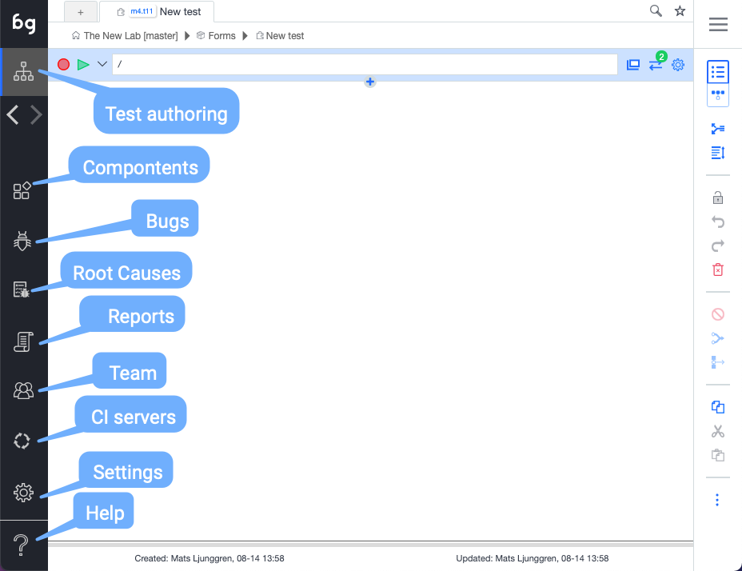

## The sidebar

import YouTubeEmbed from "@site/src/components/YouTubeEmbed";

<YouTubeEmbed embedId="g5iA8aJu0zE">Docusaurus green</YouTubeEmbed>

- Boozang icon

Clicking the Boozang icon is a shortcut to bring back the user to the project root. 

- Test Authoring

This is the main view to create test cases and organize them in the project tree. The test cases you create is organized into modules, to ensure maximum reusability. 

- Bugs

Bug authoring view. Use this section to record bugs, which are most often visual discrepancies of your application highlighted by the comment function.

In this view, you have access to all authoring tools, with the difference that bugs can be assigned to other members of your team.

- Root causes / Known issues

Bugs that encountered during your tests can be mapped to known issues, and categorized an application issue, automation issue, or unknown. Boozang captured a checksum of the error, which allows you to recognize an issue as it re-occurs. Here you can also link them to an existing TR / bug report in an external system. This classification also plays a roll in the root-case analysis. 

- Reports

The report view contains the report of the test runs. The latest test run will be shown by default, but previous test runs that were saved, either from the IDE or from a CI run, can also be loaded from the server. In this view, a user can also access operation logs, which contain all project updates, and request logs. 

- CI server / Worker view

In this view, you can find integration wizards for most common CI servers: Jenkins, GitHub actions, GitLab, Azure, and Circle CI. Boozang will integrate to any CI server with Docker support, so there is a generic Docker option as well, to facilaite this. In this view, you can also monitor all active workers (test processes) that are currently running.  

- Settings

The project settings allow the user to set: Environment, Content Policy, Notifications, and Preferences.

- Tools

In tools, you will find import and export tools for the project. This allows an admin user to backup projects and also to import projects from other users. There is also a powerful free-text search that can search both modules and test and data, and perform replacement as well. 

Recently the ability to branch the project version, and merge branches was also added. This powerful functionality enables collaboration much like the beloved versioning system Git, and allows you to align the automation process with the software development process. 

## The hamburger menu

- Management

Takes the user to the Boozang Cloud Management interface. This allows the user to switch between projects. 

- Account

Access the account page. Here you can see current service usage and your current license tier. 

- Post ticket to Boozang

Open a ticket directly to Boozang support from the tool.

- Chat & Message

Opens a popup chat with the team. Here you can monitor project activity and chat with other project members. 

- Video Tutorials

This is a link to the video tutorials on the homepage. 

- Documentation

This is a link to the latest version of this document. 

- Video Helper

This opens a small helper that gives you topic-based video help based on certain topics. 

Note: Some of this video material may have been recorded on top of previous versions of Boozang. 

- Sign Out

Log out the user. 

## The top bar

[example image](../images/topbar.png "Top bar")

- New tab

Open a new tab. 

- Current tab

Boozang supports tabbed navigation similar to a desktop IDE like VS Code. Helpful when working on several tests at once. 

- Navigation bar

The navigation bar tells you where you are in the project tree, and enables you to quickly navigate it. From the image

- Project: The New Lab
- Branch: master
- Module: Forms
- Test: New test

By clicking any entry or arrow in the navigation bar you can navigate the tree. For instance, to change branch, simply click "master". The navigation is similar to Jenkins, where clicking an entity will navigate you there, while clicking an arrow will allow you to navigate between modules and tests, respectively. 

- Bookmark 

Bookmark tests and modules as you see fit by clicking the star. Simply click the star a second time to remove bookmark. The bookmark menu will show on hover. 

- Search

Search the project for any test, module, or Cucumber test step. Use advanced testing to do more specific searches, like variable names or page elements. 

- Record

Start a recording of a test. If application window is closed, it will open at the give URL.

- Play

Plays the test from the URL given.

- Application URL

The URL for the test. If you want the test execution to be based on the current application window state, make sure to set the test reload policy to "Never reload". 

- Open Window

Opens the application window at the current URL.

- Requests

Registers all requests to the back-end, such as Restful API calls. Click to open API "snoop" menu, that allows you to record API tests by doing UI interactions. 

- Test Settings

Set specific settings for the test execution. The default settings is usually ok, so this is normally not necessary. 

## The right bar

###### Switch view: Table / GUI

The switch view button toggles between table and diagram view.

The table view should be used when authoring tests, and is the view you will use a majority of the time. The GUI will is useful to understand how the test intercats with other tests. 

- Navigate to parent

Navigate up the testing tree. 

- Expand action rows

Expand the action rows to show more test information. The expanded view is useful to troubleshoot passing of parameters and customized exit conditions. 

- Lock

Lock the test case to prevent other team member from modifying the test. As tests are auto-saved in Boozang and all other team members recieve these updates automatically, all tests are unlocked by default. 

- Undo / Redo

Undo or Redo latest modification. 

- Delete

Deletes one or several actions.  You can also use the "Delete" key. 

*Tip: Use Ctrl/CMD functions to multi-select.*

- Disable

A disabled action is skipped when a test is run. Useful to debug tests. 

- Group

The group function group's actions together. This allows you do keep your test in order, and to skip a set of actions using the exit condition Exit Group. By using Else-group, this can be used to implement simple conditional functionality (compare: if / else)

*Tip: Use Ctrl/CMD functions to multi-select actions.*

- Generate test case

Breaks up a group of actions into a separate test and replaces the group with a reference to that test (Plug-test case). It allows you to quickly refactor your tests to remove duplicate action sequences.

*Tip: Use Ctrl/CMD functions to multi-select.*

- Cut / Copy /Paste

Standard Cut functionality. Use Cut and Paste to move actions between tests, tests between modules, or data between tests and modules.

*Tip: Use Ctrl/CMD functions to multi-select.*

- Kebab menu (...)

This menu contains functions that are used less frequently.