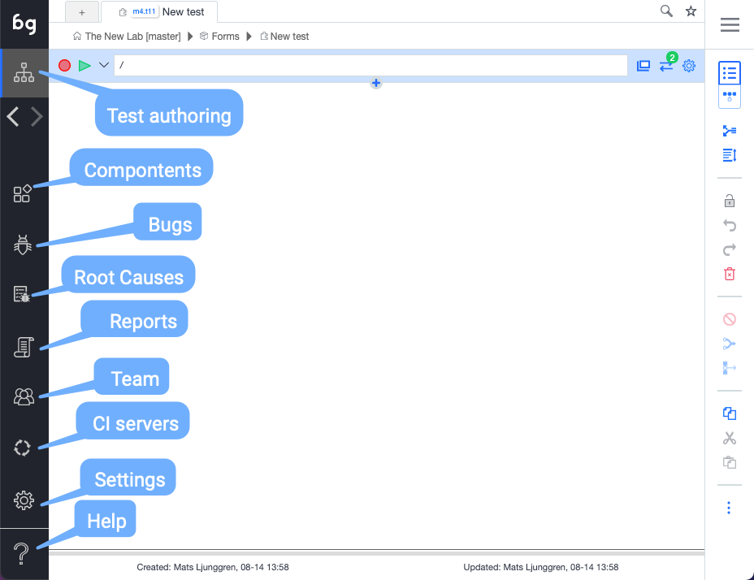

import YouTubeEmbed from "@site/src/components/YouTubeEmbed";

<YouTubeEmbed embedId="g5iA8aJu0zE">Docusaurus green</YouTubeEmbed>

## Boozang icon

Clicking the Boozang icon is a shortcut to bring back the user to the project root. 

## Test Authoring

This is the main view to create test cases and organize them in the project tree. The test cases you create is organized into modules, to ensure maximum reusability. 

## Bugs

Bug authoring view. Use this section to record bugs, which are most often visual discrepancies of your application highlighted by the comment function.

In this view, you have access to all authoring tools, with the difference that bugs can be assigned to other members of your team.

## Root causes / Known issues

Bugs that encountered during your tests can be mapped to known issues, and categorized an application issue, automation issue, or unknown. Boozang captured a checksum of the error, which allows you to recognize an issue as it re-occurs. Here you can also link them to an existing TR / bug report in an external system. This classification also plays a roll in the root-case analysis. 

## Reports

The report view contains the report of the test runs. The latest test run will be shown by default, but previous test runs that were saved, either from the IDE or from a CI run, can also be loaded from the server. In this view, a user can also access operation logs, which contain all project updates, and request logs. 

## CI server / Worker view

In this view, you can find integration wizards for most common CI servers: Jenkins, GitHub actions, GitLab, Azure, and Circle CI. Boozang will integrate to any CI server with Docker support, so there is a generic Docker option as well, to facilaite this. In this view, you can also monitor all active workers (test processes) that are currently running.  

## Settings

The project settings allow the user to set: Environment, Content Policy, Notifications, and Preferences.

## Tools

In tools, you will find import and export tools for the project. This allows an admin user to backup projects and also to import projects from other users. There is also a powerful free-text search that can search both modules and test and data, and perform replacement as well. 

Recently the ability to branch the project version, and merge branches was also added. This powerful functionality enables collaboration much like the beloved versioning system Git, and allows you to align the automation process with the software development process. 
