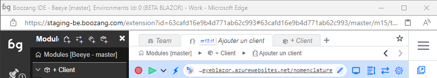

- New tab

Open a new tab. 

- Current tab

Boozang supports tabbed navigation similar to a desktop IDE like VS Code. Helpful when working on several tests at once. 

- Navigation bar

The navigation bar tells you where you are in the project tree, and enables you to quickly navigate it. From the image

- Project: The New Lab
- Branch: master
- Module: Forms
- Test: New test

By clicking any entry or arrow in the navigation bar you can navigate the tree. For instance, to change branch, simply click "master". The navigation is similar to Jenkins, where clicking an entity will navigate you there, while clicking an arrow will allow you to navigate between modules and tests, respectively. 

- Bookmark 

Bookmark tests and modules as you see fit by clicking the star. Simply click the star a second time to remove bookmark. The bookmark menu will show on hover. 

- Search

Search the project for any test, module, or Cucumber test step. Use advanced testing to do more specific searches, like variable names or page elements. 

- Record

Start a recording of a test. If application window is closed, it will open at the give URL.

- Play

Plays the test from the URL given.

- Application URL

The URL for the test. If you want the test execution to be based on the current application window state, make sure to set the test reload policy to "Never reload". 

- Open Window

Opens the application window at the current URL.

- Requests

Registers all requests to the back-end, such as Restful API calls. Click to open API "snoop" menu, that allows you to record API tests by doing UI interactions. 

- Test Settings

Set specific settings for the test execution. The default settings is usually ok, so this is normally not necessary. 