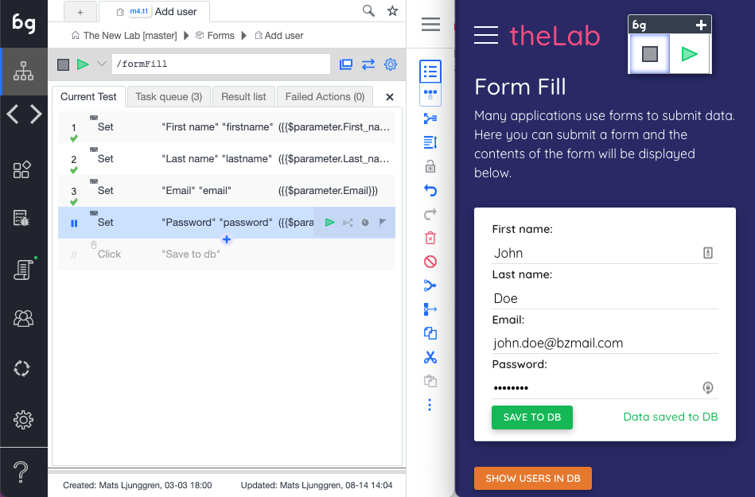

import YouTubeEmbed from "@site/src/components/YouTubeEmbed";

Boozang works within the browser which allows for a very stable recording function. Simply click on the record button in the tool. As you perform actions on your web page actions will be recorded. To remove an un-wanted action that was recorded press the trashbin next to the action in the main tool view. 

As soon as a test has been created you can use the playback button to replay the test steps. Boozang supports four different playback modes: **Normal**, **demo**, **remote** and **automation** mode. Demo mode slows down the playback speed and annotates every test step. This is good for demos and when trying to understand a test that someone else has authored. Remote play allows you to dispatch a test run to a remote server. Upon completion of the test, the result will be reported back to you.

A test is automatically saved in the local storage of the browser. If you want to prevent other team members from doing any changes to a test you are working on, click the lock. Other team members will see the test as locked, and will be un-able to do any changes. Any lock can be forcibly opened by any other team member. You will be notified if someone unlocks a test you have locked. 

## A note on Window alignment

To use Boozang well, we recommend aligning the Boozang tool and your application next to each other side by side in the following way

This allows you to get a good overview of the recorded actions, and an easy way to modify or delete recorded actions.

<YouTubeEmbed embedId="YcCw6cS7Uy0">Docusaurus green</YouTubeEmbed>

