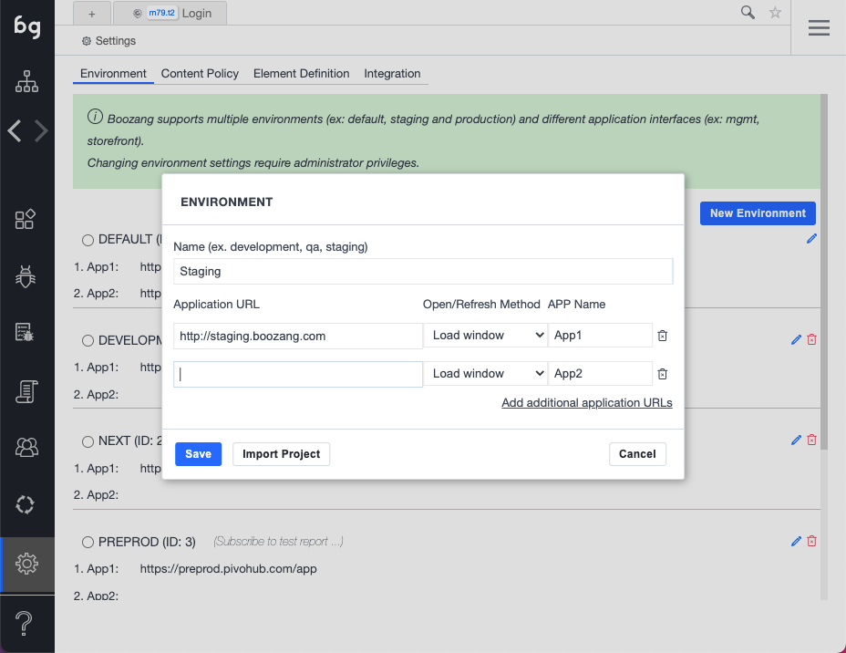

In the Environment tab, you can find several useful functionalities. You can manage environments and different application interfaces, configure settings on an application interface level and also setup AI login/logout for different roles/users.

###### Enviroment and application interfaces

There has been some confusion around environment and application interfaces, so it's important to make sure you get this right as it will save you potential work in the future. Environments signify an environment, such as *development*, *staging*, *QA* or *production*. By specifying different entry URLs for these environments, test become completely re-usable. This means there is no need to maintain different tests or projects across different environments. Simply change the environment setting and re-run the same test.

The application interface setting handles when there are different applications within the same environment. For instance, in the E-commerce case, there might be a *storefront* and a *managememt* interface. When creating a test, pick the interface that the test is for. If this changes during the project, it has to be changed in one place, not across several tests.

###### Advanced / Configure

This setting allows you to configure certain things on an Environment / App interface level. These settings will typically be things that could vary across environments, such as delays and other performance-related settings. 

###### AI login / logout (Authorization Setting)

This allows the user to define several user roles and automatically generate the login and logout scenarios for these roles. The user roles can be set as pre-requisites for tests, automatically switching between users. For more information, read more under the **Model-based testing** chapter. 
