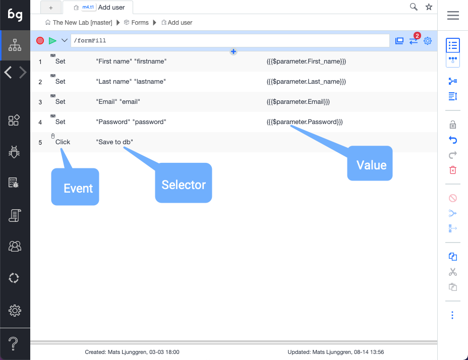
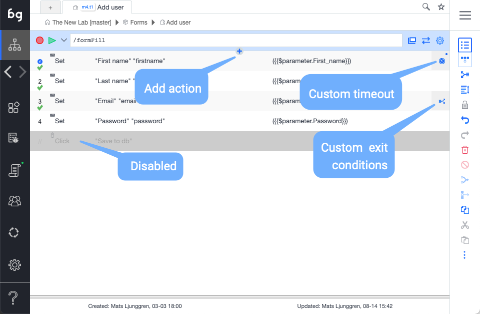

## Event

An icon, word, or both that indicates the action type. The different action types are **Set**, **Validate Result**, **Mouse Event**, **Keyboard Event**, **Extract data**, **Javascript**, **Comment**, **Refresh Window**, **Plug Test**, and **Visit Links**.  

*Tip: Clicking the action icon toggles breakpoints. Test execution is temporarily stopped at breakpoints, allowing for troubleshooting of tests. To resume playing the test, click the play button.*

## Action description

This is the human-readable description of the action and defaults to the actual action code. If needed, this can be changed on the auction details page.

## Value

The value used for applicable events (Set, Validate). Orange indicates that dynamic data is used. The following data scopes are available: $parameter, $test, $module, $project, $loop

## Add action in list

Inserts a new action in the action list manually. As events are often recorded, most other action types will be added in manually. The actions can be added during an active recording section, or when the recording has stopped. 

## Run action

Double-click on an action to execute a single action. 

## Custom timeout

Indicate that the timeouts for that particular action have been customized. This can be done by editing timeouts in action details. In the case of slow response times during recording, this will also be added automatically to ensure test stability. 

## Custom exit conditions

Indicate that exit conditions for the action have been customized. Exit conditions signify what action is taken on a certain action outcome. Action outcomes are Success, Fail, and Error. Success means the action was executed successfully, Fail means that it executed falsely, such as validation fail, and Error means element not found. 